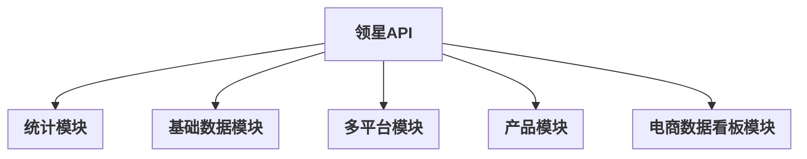
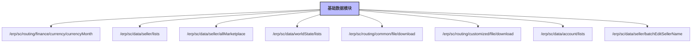
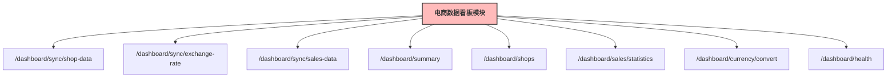

# RPA_Tornado 项目预览

---

## 📚 文档导航

- **[API路由文档](./API_ROUTES_DOCUMENTATION.md)** - 详细的API路由信息文档，包含所有模块的路由列表和功能说明
- **[Swagger API文档](./swagger_amazon_table.yaml)** - 亚马逊源表数据模块的Swagger API规范

---

## 领星API分组总览




---

## 统计模块接口从属关系

```mermaid
graph TD
    统计["<b>统计模块</b>"]
    统计1["/erp/sc/data/sales_report/asinDailyLists"]
    统计2["/statistics/order-profit-msku"]
    统计3["/erp/sc/data/sales_report/sales"]
    统计4["/bd/productPerformance/openApi/asinList"]
    统计5["/basicOpen/salesAnalysis/productPerformance/performanceTrendByHour"]
    统计6["/bd/profit/statistics/open/asin/list"]
    统计7["/basicOpen/finance/mreport/OrderProfit"]
    统计8["/erp/sc/statistic/removalShipment/list"]
    统计 --> 统计1
    统计 --> 统计2
    统计 --> 统计3
    统计 --> 统计4
    统计 --> 统计5
    统计 --> 统计6
    统计 --> 统计7
    统计 --> 统计8
    style 统计 fill:#f9f,stroke:#333,stroke-width:2px
```



---

## 基础数据模块接口从属关系



---

## 多平台模块接口从属关系

```mermaid
graph TD
    多平台["<b>多平台模块</b>"]
    多平台1["/basicOpen/platformStatisticsV2/saleStat/pageList"]
    多平台2["/basicOpen/platformStatisticsV2/saleStat/pageList/seller-list"]
    多平台3["/bd/profit/statistics/open/msku/list"]
    多平台4["/basicOpen/multiplatform/profit/report/msku"]
    多平台5["/basicOpen/multiplatform/profit/report/sku"]
    多平台6["/multi-platform/sale-statistics-v2"]
    多平台7["/multi-platform/sales-report-asin-daily-lists"]
    多平台8["/multi-platform/order-profit-msku"]
    多平台9["/multi-platform/profit-report-msku"]
    多平台10["/multi-platform/profit-report-sku"]
    多平台11["/multi-platform/seller-list"]
    多平台12["/multi-platform/profit-report-seller"]
    多平台 --> 多平台1
    多平台 --> 多平台2
    多平台 --> 多平台3
    多平台 --> 多平台4
    多平台 --> 多平台5
    多平台 --> 多平台6
    多平台 --> 多平台7
    多平台 --> 多平台8
    多平台 --> 多平台9
    多平台 --> 多平台10
    多平台 --> 多平台11
    多平台 --> 多平台12
    style 多平台 fill:#bfb,stroke:#333,stroke-width:2px
```



---

## 产品模块接口从属关系


---

## 电商数据看板模块接口从属关系



---

# RPA_Tornado 项目说明

---

## 一、项目结构

### 新架构（领域驱动设计）

```
app/
├── domains/                    # 领域模块（新架构）
│   ├── __init__.py            # 领域注册表
│   ├── statistics/            # 统计领域
│   │   ├── __init__.py       # 统计领域入口
│   │   ├── handlers.py       # 统计处理器
│   │   ├── services.py       # 统计服务
│   │   └── routes.py         # 统计路由
│   ├── base_data/            # 基础数据领域
│   │   ├── __init__.py       # 基础数据领域入口
│   │   ├── handlers.py       # 基础数据处理器
│   │   ├── services.py       # 基础数据服务
│   │   └── routes.py         # 基础数据路由
│   ├── multi_platform/       # 多平台领域
│   │   ├── __init__.py       # 多平台领域入口
│   │   ├── handlers.py       # 多平台处理器
│   │   ├── services.py       # 多平台服务
│   │   └── routes.py         # 多平台路由
│   ├── product/              # 产品领域
│   │   ├── __init__.py       # 产品领域入口
│   │   ├── handlers.py       # 产品处理器
│   │   ├── services.py       # 产品服务
│   │   └── routes.py         # 产品路由
│   └── ecommerce_dashboard/  # 电商数据看板领域
│       ├── __init__.py       # 电商数据看板领域入口
│       ├── handlers.py       # 电商数据看板处理器
│       ├── services.py       # 电商数据看板服务
│       └── routes.py         # 电商数据看板路由
├── schemas/                   # 数据传输对象模式
│   ├── statistics_schemas.py  # 统计模块数据模式
│   ├── base_data_schemas.py   # 基础数据模块数据模式
│   ├── multi_platform_schemas.py # 多平台模块数据模式
│   ├── product_schemas.py     # 产品模块数据模式
│   └── dashboard_schemas.py   # 电商数据看板模块数据模式
├── core/                      # 核心模块
│   ├── exceptions/           # 异常处理
│   │   └── base_exceptions.py # 基础异常类
│   └── security/             # 安全模块
│       ├── rate_limiter.py   # 限流器
│       └── validators.py     # 验证器
├── middleware/               # 中间件模块
│   ├── __init__.py          # 中间件注册
│   ├── auth.py              # 认证中间件
│   ├── cors.py              # CORS中间件
│   ├── logging.py           # 日志中间件
│   ├── error_handler.py     # 错误处理中间件
│   ├── rate_limit.py        # 限流中间件
│   └── security.py          # 安全中间件
├── shared/                    # 共享模块
│   ├── enums/               # 枚举定义
│   ├── constants/           # 常量定义
│   └── utils/               # 工具函数
├── config.py                 # 配置管理
└── main.py                   # 启动入口
```

### 传统架构（兼容保留）

- `app/ecommerce_dashboard/handlers/stat_handler.py`  电商数据看板主接口
- `app/ecommerce_dashboard/services/stat_service.py`  电商数据看板主业务逻辑
- `app/ecommerce_dashboard/services/common.py`        通用API请求工具
- `app/ecommerce_dashboard/routes.py`                 路由注册
- `main.py`                                          启动入口，统一管理所有接口

### 架构特点

1. **领域驱动设计（DDD）**：按业务领域组织代码，每个领域包含完整的业务逻辑
2. **模块化架构**：清晰的模块边界，便于维护和扩展
3. **数据验证**：使用Pydantic进行请求和响应数据验证
4. **异常处理**：统一的异常处理机制
5. **中间件系统**：完整的中间件支持（认证、CORS、日志、限流、安全等）
6. **配置管理**：支持多环境配置和环境变量管理
7. **安全防护**：内置安全头、CSRF防护、XSS防护等安全机制
8. **限流保护**：基于令牌桶算法的API限流
9. **向后兼容**：新架构与原有代码兼容，平滑迁移

### 新增功能

#### 中间件系统
- **认证中间件** (`auth.py`)：提供用户认证和授权功能
- **CORS中间件** (`cors.py`)：处理跨域请求
- **日志中间件** (`logging.py`)：统一请求日志记录
- **错误处理中间件** (`error_handler.py`)：统一异常处理和错误响应
- **限流中间件** (`rate_limit.py`)：基于令牌桶的API限流
- **安全中间件** (`security.py`)：安全头设置和安全防护

#### 配置管理
- **多环境支持**：开发、生产、测试环境配置
- **环境变量管理**：使用 `.env` 文件管理敏感配置
- **配置验证**：配置项验证和默认值设置

#### 管理脚本
- **启动脚本** (`scripts/start.py`)：支持多环境启动
- **开发环境设置** (`scripts/setup_dev.py`)：自动化开发环境配置
- **数据库管理** (`scripts/db_manager.py`)：数据库备份、恢复、维护
- **工具脚本** (`scripts/utils.py`)：代码格式化、质量检查、性能分析

---

## 二、环境准备

### 依赖安装

建议使用虚拟环境：

```bash
# 创建虚拟环境
python -m venv .venv

# 激活虚拟环境
.venv\Scripts\activate  # Windows
# source .venv/bin/activate  # Linux/Mac

# 安装依赖
pip install -r requirements.txt
```

### 自动化开发环境设置

使用提供的脚本自动配置开发环境：

```bash
# 进入项目目录
cd RPA_Tornado

# 运行开发环境设置脚本
python scripts/setup_dev.py
```

该脚本会自动：
- 检查Python版本和虚拟环境
- 安装项目依赖
- 创建 `.env` 配置文件
- 创建必要的目录结构
- 验证关键依赖
- 运行基础测试

---

## 三、环境配置

### 配置文件设置

1. **复制环境变量模板**：
   ```bash
   cp .env.example .env
   ```

2. **编辑 `.env` 文件**，配置必要的参数：
   ```env
   # 应用配置
   APP_NAME=RPA_Tornado
   APP_VERSION=1.0.0
   APP_DEBUG=true
   APP_HOST=0.0.0.0
   APP_PORT=8888
   
   # 领星API配置
   LINGXING_API_HOST=https://api.lingxing.com
   LINGXING_APP_ID=your_app_id
   LINGXING_APP_SECRET=your_app_secret
   
   # 数据库配置
   DATABASE_URL=sqlite:///./data/app.db
   
   # 日志配置
   LOG_LEVEL=INFO
   LOG_FILE=logs/app.log
   
   # 安全配置
   SECRET_KEY=your_secret_key_here
   
   # API限流配置
   RATE_LIMIT_CAPACITY=10
   RATE_LIMIT_REFILL_RATE=1.0
   ```

3. **多环境配置支持**：
   - 开发环境：`ENVIRONMENT=development`
   - 生产环境：`ENVIRONMENT=production`
   - 测试环境：`ENVIRONMENT=testing`

### 配置管理特性

- **环境变量优先级**：环境变量 > .env文件 > 默认值
- **配置验证**：启动时自动验证必要配置项
- **敏感信息保护**：敏感配置通过环境变量管理
- **多环境支持**：不同环境使用不同的配置集

### 配置文件说明

#### 领域配置文件 (`config/domains.yaml`)

定义各个领域模块的配置信息，包括：
- 全局API配置（版本、路径、CORS、限流等）
- 各领域模块配置（统计、基础数据、多平台、产品）
- 数据库连接池配置
- 缓存配置
- 日志配置
- 监控配置

#### API文档配置文件 (`config/api_docs.yaml`)

定义API文档的生成配置，包括：
- OpenAPI 3.0规范配置
- 文档生成设置
- 按领域分组的标签配置
- 安全认证配置
- 响应示例配置
- 通用组件模式
- 文档主题配置
- 代码生成配置

---

## 四、项目启动

### 推荐启动方式

使用提供的启动脚本：

```bash
# 开发环境启动
python scripts/start.py --env development

# 生产环境启动
python scripts/start.py --env production

# 指定端口和主机
python scripts/start.py --env development --port 9000 --host 127.0.0.1

# 启用调试模式
python scripts/start.py --env development --debug
```

### 传统方式启动

在项目根目录下执行：

```bash
# 基本启动
python main.py

# 指定环境启动
python main.py --environment=development

# 启动前自动杀掉占用端口的进程（避免端口占用问题）
python main.py --environment=development --kill_port

# 指定端口和主机
python main.py --port=9000 --host=127.0.0.1

# 启用调试模式
python main.py --debug
```

#### 命令行参数说明

- `--environment`: 运行环境 (development/production，默认: development)
- `--port`: 服务端口 (默认: 8888)
- `--host`: 监听地址 (默认: 0.0.0.0)
- `--debug`: 调试模式 (默认: False)
- `--kill_port`: 启动前自动杀掉占用端口的进程 (默认: False)

### 启动后访问

- **健康检查**：GET http://127.0.0.1:8888/health
- **API接口示例**：POST http://127.0.0.1:8888/api/ecommerce/sale_stat
- **应用信息**：启动时会显示详细的服务信息

### 管理脚本

#### 数据库管理

```bash
# 初始化数据库
python scripts/db_manager.py init

# 备份数据库
python scripts/db_manager.py backup

# 恢复数据库
python scripts/db_manager.py restore backup_20241201_120000.db

# 检查数据库完整性
python scripts/db_manager.py check

# 导出数据为JSON
python scripts/db_manager.py export data_export.json
```

#### 电商数据看板数据库操作

```bash
# 数据库初始化（自动创建表结构）
python db_tests/db_init.py

# 数据同步（同步指定时间区间的电商数据）
python db_tests/sync_data.py --start-date 2025-06-01 --end-date 2025-08-12

# 查看同步帮助信息
python db_tests/sync_data.py --help
```

**数据库初始化功能：**
- 自动检查数据库连接
- 创建必要的数据表（shops、sales、exchange_rate）
- 验证表结构完整性
- 提供详细的初始化日志

**数据同步功能：**
- 同步店铺数据（从API获取店铺列表）
- 同步汇率数据（按月份获取汇率信息）
- 同步销售数据（指定时间区间的销售统计）
- 支持增量同步和数据去重
- 提供详细的同步进度和结果报告

#### 开发工具

```bash
# 代码格式化
python scripts/utils.py format

# 代码质量检查
python scripts/utils.py lint

# 依赖分析
python scripts/utils.py deps

# 性能分析
python scripts/utils.py profile

# 清理项目文件
python scripts/utils.py clean

# 项目统计信息
python scripts/utils.py stats
```

### Docker方式启动

#### 使用Docker Compose（推荐）

```bash
# 启动所有服务（包括数据库、缓存、监控等）
docker-compose up -d

# 查看服务状态
docker-compose ps

# 查看日志
docker-compose logs -f app

# 停止服务
docker-compose down
```

#### 单独构建和运行

```bash
# 构建镜像
docker build -t rpa-tornado .

# 运行容器
docker run -d -p 8888:8888 --name rpa-tornado-app rpa-tornado
```

#### 服务访问地址

- **API服务**: http://localhost:8888
- **Grafana监控**: http://localhost:3000 (admin/admin)
- **Prometheus**: http://localhost:9090
- **Jaeger链路追踪**: http://localhost:16686
- **PostgreSQL**: localhost:5432
- **Redis**: localhost:6379

---

## 五、主要接口一览（分组并列：统计、基础数据、多平台）

### 统计
| 路径 | 方法 | 功能简介 | 原始路径 |
|------|------|----------|----------|
| /api/erp/sc/data/sales_report/asinDailyLists | POST | 旧版销量报表ASIN日列表 | /erp/sc/data/sales_report/asinDailyLists |
| /api/statistics/order-profit-msku | POST | 订单利润MSKU查询 | /statistics/order-profit-msku |
| /api/erp/sc/data/sales_report/sales | POST | 查询店铺汇总销量 | /erp/sc/data/sales_report/sales |
| /api/bd/productPerformance/openApi/asinList | POST | 查询产品表现 | /bd/productPerformance/openApi/asinList |
| /api/basicOpen/salesAnalysis/productPerformance/performanceTrendByHour | POST | 查询asin360小时数据 | /basicOpen/salesAnalysis/productPerformance/performanceTrendByHour |
| /api/bd/profit/statistics/open/asin/list | POST | 利润统计-ASIN | /bd/profit/statistics/open/asin/list |
| /api/basicOpen/finance/mreport/OrderProfit | POST | 统计-订单利润MSKU | /basicOpen/finance/mreport/OrderProfit |

### 基础数据
| 路径 | 方法 | 功能简介 | 原始路径 |
|------|------|----------|----------|
| /api/erp/sc/routing/finance/currency/currencyMonth | POST | 查询汇率 | /erp/sc/routing/finance/currency/currencyMonth |
| /api/erp/sc/data/seller/lists | GET | 查询亚马逊店铺列表 | /erp/sc/data/seller/lists |
| /api/erp/sc/data/seller/allMarketplace | GET | 查询亚马逊市场列表 | /erp/sc/data/seller/allMarketplace |
| /api/erp/sc/data/worldState/lists | POST | 查询世界州/省列表 | /erp/sc/data/worldState/lists |
| /api/erp/sc/routing/common/file/download | POST | 下载产品附件 | /erp/sc/routing/common/file/download |
| /api/erp/sc/routing/customized/file/download | POST | 定制化附件下载 | /erp/sc/routing/customized/file/download |
| /api/erp/sc/data/account/lists | GET | 查询ERP用户信息列表 | /erp/sc/data/account/lists |
| /api/erp/sc/data/seller/batchEditSellerName | POST | 批量修改店铺名称 | /erp/sc/data/seller/batchEditSellerName |

### 多平台
| 路径 | 方法 | 功能简介 | 原始路径 |
|------|------|----------|----------|
| /api/basicOpen/platformStatisticsV2/saleStat/pageList | POST | 查询销量统计列表v2 | /basicOpen/platformStatisticsV2/saleStat/pageList |
| /api/basicOpen/platformStatisticsV2/saleStat/pageList/seller-list | POST | 查询多平台店铺基础信息 | /basicOpen/platformStatisticsV2/saleStat/pageList/seller-list |
| /api/bd/profit/statistics/open/msku/list | POST | 多平台订单利润MSKU（兼容老路由） | /bd/profit/statistics/open/msku/list |
| /api/basicOpen/multiplatform/profit/report/msku | POST | 多平台结算利润（利润报表）-msku | /basicOpen/multiplatform/profit/report/msku |
| /api/basicOpen/multiplatform/profit/report/sku | POST | 多平台结算利润（利润报表）-sku | /basicOpen/multiplatform/profit/report/sku |
| /api/multi-platform/sale-statistics-v2 | POST | 多平台销量统计v2（兼容路由） | /basicOpen/platformStatisticsV2/saleStat/pageList |
| /api/multi-platform/sales-report-asin-daily-lists | POST | 多平台ASIN日销量报表 | /basicOpen/platformStatisticsV2/saleStat/pageList |
| /api/multi-platform/order-profit-msku | POST | 多平台订单利润MSKU | /bd/profit/statistics/open/msku/list |
| /api/multi-platform/profit-report-msku | POST | 多平台结算利润（利润报表）-msku | /basicOpen/multiplatform/profit/report/msku |
| /api/multi-platform/profit-report-sku | POST | 多平台结算利润（利润报表）-sku | /basicOpen/multiplatform/profit/report/sku |
| /api/multi-platform/seller-list | POST | 多平台店铺信息查询 | /basicOpen/platformStatisticsV2/saleStat/pageList/seller-list |
| /api/multi-platform/profit-report-seller | POST | 多平台结算利润（利润报表）-店铺 | /basicOpen/multiplatform/profit/report/msku |

### 产品
| 路径 | 方法 | 功能简介 | 原始路径 |
|------|------|----------|----------|
| /api/erp/sc/routing/data/local_inventory/productList | POST | 查询本地产品列表 | /erp/sc/routing/data/local_inventory/productList |
| /api/listing/publish/api/upc/addCommodityCode | POST | 创建UPC编码 | /listing/publish/api/upc/addCommodityCode |
| /api/listing/publish/api/upc/upcList | POST | 获取UPC编码列表 | /listing/publish/api/upc/upcList |
| /api/erp/sc/routing/data/local_inventory/productInfo | POST | 查询本地产品详情 | /erp/sc/routing/data/local_inventory/productInfo |
| /api/erp/sc/routing/data/local_inventory/batchGetProductInfo | POST | 批量查询本地产品详情 | /erp/sc/routing/data/local_inventory/batchGetProductInfo |
| /api/basicOpen/product/productManager/product/operate/batch | POST | 产品启用、禁用 | /basicOpen/product/productManager/product/operate/batch |
| /api/erp/sc/routing/storage/product/set | POST | 添加/编辑本地产品 | /erp/sc/routing/storage/product/set |
| /api/erp/sc/routing/storage/attribute/attributeList | POST | 查询产品属性列表 | /erp/sc/routing/storage/attribute/attributeList |
| /api/erp/sc/routing/storage/attribute/set | POST | 添加/编辑产品属性 | /erp/sc/routing/storage/attribute/set |
| /api/erp/sc/routing/storage/spu/spuList | POST | 查询多属性产品列表 | /erp/sc/routing/storage/spu/spuList |
| /api/erp/sc/routing/storage/spu/info | POST | 查询多属性产品详情 | /erp/sc/routing/storage/spu/info |
| /api/erp/sc/routing/data/local_inventory/bundledProductList | POST | 查询捆绑产品关系列表 | /erp/sc/routing/data/local_inventory/bundledProductList |
| /api/erp/sc/routing/storage/product/setBundled | POST | 添加/编辑捆绑产品 | /erp/sc/routing/storage/product/setBundled |
| /api/erp/sc/routing/data/local_inventory/productAuxList | POST | 查询产品辅料列表 | /erp/sc/routing/data/local_inventory/productAuxList |
| /api/erp/sc/routing/storage/product/setAux | POST | 添加/编辑辅料 | /erp/sc/routing/storage/product/setAux |
| /api/erp/sc/data/local_inventory/brand | POST | 查询产品品牌列表 | /erp/sc/data/local_inventory/brand |
| /api/erp/sc/storage/brand/set | POST | 添加/编辑产品品牌 | /erp/sc/storage/brand/set |
| /api/erp/sc/routing/data/local_inventory/category | POST | 查询产品分类列表 | /erp/sc/routing/data/local_inventory/category |
| /api/erp/sc/routing/storage/category/set | POST | 添加/编辑产品分类 | /erp/sc/routing/storage/category/set |
| /api/erp/sc/routing/storage/product/uploadPictures | POST | 上传本地产品图片 | /erp/sc/routing/storage/product/uploadPictures |
| /api/label/operation/v1/label/product/list | GET | 查询产品标签 | /label/operation/v1/label/product/list |
| /api/label/operation/v1/label/product/create | POST | 创建产品标签 | /label/operation/v1/label/product/create |
| /api/label/operation/v1/label/product/mark | POST | 标记产品标签 | /label/operation/v1/label/product/mark |
| /api/label/operation/v1/label/product/unmarkLabel | POST | 删除产品标签 | /label/operation/v1/label/product/unmarkLabel |

---

### 接口映射与限流说明

| API Path（转发路由） | 领星接口路径 | 请求协议 | 请求方式 | 令牌桶容量 | 简要说明 |
|---------------------|----------|----------|----------|------------|----------|
| /api/ecommerce/sale_stat | /basicOpen/platformStatisticsV2/saleStat/pageList | HTTPS | POST | 10 | 电商销售统计 |
| /api/base-data/currency-exchange-rate | /erp/sc/routing/finance/currency/currencyMonth | HTTPS | POST | 10 | 查询汇率 |
| /api/base-data/file-attachment-download | /erp/sc/routing/common/file/download | HTTPS | POST | 10 | 下载产品附件 |
| /api/base-data/customized-file-download | /erp/sc/routing/customized/file/download | HTTPS | POST | 10 | 定制化附件下载 |
| /api/base-data/batch-edit-seller-name | /erp/sc/data/seller/batchEditSellerName | HTTPS | POST | 10 | 批量修改店铺名称 |
| /api/multi-platform/sale-statistics-v2 | /basicOpen/platformStatisticsV2/saleStat/pageList | HTTPS | POST | 10 | 多平台销量统计 |
| /api/multi-platform/sales-report-asin-daily-lists | /basicOpen/platformStatisticsV2/saleStat/pageList | HTTPS | POST | 10 | 多平台ASIN日销量报表 |
| /api/statistics/order-profit-msku | /bd/profit/statistics/open/msku/list | HTTPS | POST | 10 | 订单利润MSKU查询 |
| /api/erp/sc/data/sales_report/asinDailyLists | /erp/sc/data/sales_report/asinDailyLists | HTTPS | POST | 5 | 查询销量、订单量、销售额 |
| /api/erp/sc/routing/data/local_inventory/productList | /erp/sc/routing/data/local_inventory/productList | HTTPS | POST | 10 | 查询本地产品列表 |
| /api/label/operation/v1/label/product/create | /label/operation/v1/label/product/create | HTTPS | POST | 10 | 创建产品标签 |
| /api/label/operation/v1/label/product/mark | /label/operation/v1/label/product/mark | HTTPS | POST | 10 | 标记产品标签 |
| /api/label/operation/v1/label/product/unmarkLabel | /label/operation/v1/label/product/unmarkLabel | HTTPS | POST | 10 | 删除产品标签 |
| ... | ... | ... | ... | ... | ... |

> 说明：如需补充更多接口原路由或限流参数，请参考源码 service 层的 api_request/route_name 字段或联系后端开发。

---

## 六、接口参数与示例（按功能分组）

### 多平台
- 路径：`/api/basicOpen/platformStatisticsV2/saleStat/pageList`  
- 方法：POST
- 原始路由：`/basicOpen/platformStatisticsV2/saleStat/pageList`
- 主要参数：
  | 参数名 | 类型 | 必填 | 说明 | 示例 |
  |--------|------|------|------|------|
  | offset | int | 是 | 分页偏移量，默认0 | 0 |
  | length | int | 是 | 分页长度，默认1000 | 100 |
  | platformCodeS | array | 否 | 平台id数组 | ["10024"] |
  | mids | string | 否 | 国家id，多个用英文逗号分隔 | "NA,MX,BR,US,CA" |
  | sids | string | 否 | 店铺id，多个用英文逗号分隔 | "110424575139430912" |
  | currencyCode | string | 否 | 币种code | "USD" |
  | startDate | string | 是 | 开始时间，Y-m-d | 2024-09-01 |
  | endDate | string | 是 | 结束时间，Y-m-d | 2024-09-30 |
  | searchField | string | 否 | 搜索值类型：msku,local_sku,platform_order_no | "local_sku" |
  | searchValue | string | 否 | 搜索值 | "123" |
  | developers | array | 否 | 开发人 | [128581] |
  | cids | array | 否 | 分类 | [14] |
  | bids | array | 否 | 品牌 | [2] |
- 返回：
```json
{
  "code": 0,
  "message": "success",
  "data": { ... }
}
```

- 路径：`/api/basicOpen/platformStatisticsV2/saleStat/pageList/seller-list`  
- 方法：POST
- 原始路由：`/basicOpen/platformStatisticsV2/saleStat/pageList/seller-list`
- 主要参数：
  | 参数名 | 类型 | 必填 | 说明 | 示例 |
  |--------|------|------|------|------|
  | offset | int | 是 | 分页偏移量，默认0 | 0 |
  | length | int | 是 | 分页长度，默认1000 | 100 |
  | platformCodeS | array | 否 | 平台id数组 | ["10024"] |
  | mids | string | 否 | 国家id，多个用英文逗号分隔 | "NA,MX,BR,US,CA" |
  | sids | string | 否 | 店铺id，多个用英文逗号分隔 | "110424575139430912" |
  | currencyCode | string | 否 | 币种code | "USD" |
  | startDate | string | 是 | 开始时间，Y-m-d | 2024-09-01 |
  | endDate | string | 是 | 结束时间，Y-m-d | 2024-09-30 |
  | searchField | string | 否 | 搜索值类型：msku,local_sku,platform_order_no | "local_sku" |
  | searchValue | string | 否 | 搜索值 | "123" |
  | developers | array | 否 | 开发人 | [128581] |
  | cids | array | 否 | 分类 | [14] |
  | bids | array | 否 | 品牌 | [2] |
- 返回：
```json
{
  "code": 0,
  "message": "success",
  "data": { ... }
}
```

- 路径：`/api/basicOpen/multiplatform/profit/report/msku`
- 方法：POST
- 原始路由：`/api/basicOpen/multiplatform/profit/report/msku`
- 主要参数：
  | 参数名 | 类型 | 必填 | 说明 | 示例 |
  |--------|------|------|------|------|
  | offset | int | 是 | 分页偏移量，默认0 | 0 |
  | length | int | 是 | 分页长度，默认1000 | 100 |
  | platformCodeS | array | 否 | 平台id数组 | ["10024"] |
  | mids | string | 否 | 国家id，多个用英文逗号分隔 | "NA,MX,BR,US,CA" |
  | sids | string | 否 | 店铺id，多个用英文逗号分隔 | "110424575139430912" |
  | currencyCode | string | 否 | 币种code | "USD" |
  | startDate | string | 是 | 开始时间，Y-m-d | 2024-09-01 |
  | endDate | string | 是 | 结束时间，Y-m-d | 2024-09-30 |
  | searchField | string | 否 | 搜索值类型：msku,local_sku,platform_order_no | "local_sku" |
  | searchValue | string | 否 | 搜索值 | "123" |
  | developers | array | 否 | 开发人 | [128581] |
  | cids | array | 否 | 分类 | [14] |
  | bids | array | 否 | 品牌 | [2] |
- 返回：
```json
{
  "code": 0,
  "message": "success",
  "data": { ... }
}
```

- 路径：`/api/basicOpen/multiplatform/profit/report/sku`
- 方法：POST
- 原始路由：`/api/basicOpen/multiplatform/profit/report/sku`
- 主要参数：
  | 参数名 | 类型 | 必填 | 说明 | 示例 |
  |--------|------|------|------|------|
  | offset | int | 是 | 分页偏移量，默认0 | 0 |
  | length | int | 是 | 分页长度，默认1000 | 20 |
  | platformCodeS | array | 否 | 平台id数组 | ["10024"] |
  | mids | string | 是 | 国家id，多个用英文逗号分隔 | "NA,MX,BR,US,CA" |
  | sids | string | 否 | 店铺id，多个用英文逗号分隔 | "110424575139430912" |
  | currencyCode | string | 否 | 币种code | "USD" |
  | startDate | string | 是 | 开始时间，Y-m-d | 2024-09-01 |
  | endDate | string | 是 | 结束时间，Y-m-d | 2024-09-30 |
  | searchField | string | 否 | 搜索值类型：local_sku,platform_order_no | "local_sku" |
  | searchValue | string | 否 | 搜索值 | "123" |
  | developers | array | 否 | 开发人 | [128581] |
  | cids | array | 否 | 分类 | [14] |
  | bids | array | 否 | 品牌 | [2] |
- 返回：
```json
{
  "code": 0,
  "message": "success",
  "data": { ... }
}
```

### 统计
- 路径：`/api/basicOpen/finance/mreport/OrderProfit`
- 方法：POST
- 原始路由：`/basicOpen/finance/mreport/OrderProfit`
- 主要参数：
  | 参数名 | 类型 | 必填 | 说明 | 示例 |
  |--------|------|------|------|------|
  | offset | int | 是 | 分页偏移量，默认0 | 0 |
  | length | int | 是 | 分页长度，默认1000 | 100 |
  | platformCodeS | array | 否 | 平台id数组 | ["10024"] |
  | mids | string | 否 | 国家id，多个用英文逗号分隔 | "NA,MX,BR,US,CA" |
  | sids | string | 否 | 店铺id，多个用英文逗号分隔 | "110424575139430912" |
  | currencyCode | string | 否 | 币种code | "USD" |
  | startDate | string | 是 | 开始时间，Y-m-d | 2024-09-01 |
  | endDate | string | 是 | 结束时间，Y-m-d | 2024-09-30 |
  | searchField | string | 否 | 搜索值类型：msku,local_sku,platform_order_no | "local_sku" |
  | searchValue | string | 否 | 搜索值 | "123" |
  | developers | array | 否 | 开发人 | [128581] |
  | cids | array | 否 | 分类 | [14] |
  | bids | array | 否 | 品牌 | [2] |
- 返回：
```json
{
  "code": 0,
  "message": "success",
  "data": { ... }
}
```

- 路径：`/api/bd/profit/statistics/open/msku/list`
- 方法：POST
- 原始路由：`/bd/profit/statistics/open/msku/list`
- 主要参数：
  | 参数名 | 类型 | 必填 | 说明 | 示例 |
  |--------|------|------|------|------|
  | offset | int | 是 | 分页偏移量，默认0 | 0 |
  | length | int | 是 | 分页长度，默认1000 | 100 |
  | platformCodeS | array | 否 | 平台id数组 | ["10024"] |
  | mids | string | 否 | 国家id，多个用英文逗号分隔 | "NA,MX,BR,US,CA" |
  | sids | string | 否 | 店铺id，多个用英文逗号分隔 | "110424575139430912" |
  | currencyCode | string | 否 | 币种code | "USD" |
  | startDate | string | 是 | 开始时间，Y-m-d | 2024-09-01 |
  | endDate | string | 是 | 结束时间，Y-m-d | 2024-09-30 |
  | searchField | string | 否 | 搜索值类型：msku,local_sku,platform_order_no | "local_sku" |
  | searchValue | string | 否 | 搜索值 | "123" |
  | developers | array | 否 | 开发人 | [128581] |
  | cids | array | 否 | 分类 | [14] |
  | bids | array | 否 | 品牌 | [2] |
- 返回：
```json
{
  "code": 0,
  "message": "success",
  "data": { ... }
}
```

- 路径：`/api/statistics/order-profit-msku`
- 方法：POST
- 原始路由：`/statistics/order-profit-msku`
- 主要参数：
  | 参数名 | 类型 | 必填 | 说明 | 示例 |
  |--------|------|------|------|------|
  | offset | int | 是 | 分页偏移量，默认0 | 0 |
  | length | int | 是 | 分页长度，默认1000 | 100 |
  | platformCodeS | array | 否 | 平台id数组 | ["10024"] |
  | mids | string | 否 | 国家id，多个用英文逗号分隔 | "NA,MX,BR,US,CA" |
  | sids | string | 否 | 店铺id，多个用英文逗号分隔 | "110424575139430912" |
  | currencyCode | string | 否 | 币种code | "USD" |
  | startDate | string | 是 | 开始时间，Y-m-d | 2024-09-01 |
  | endDate | string | 是 | 结束时间，Y-m-d | 2024-09-30 |
  | searchField | string | 否 | 搜索值类型：msku,local_sku,platform_order_no | "local_sku" |
  | searchValue | string | 否 | 搜索值 | "123" |
  | developers | array | 否 | 开发人 | [128581] |
  | cids | array | 否 | 分类 | [14] |
  | bids | array | 否 | 品牌 | [2] |
- 返回：
```json
{
  "code": 0,
  "message": "success",
  "data": { ... }
}
```

- 路径：`/api/statistics/sales-report-asin-daily-lists`
- 方法：POST
- 原始路由：`/statistics/sales-report-asin-daily-lists`
- 主要参数：
  | 参数名 | 类型 | 必填 | 说明 | 示例 |
  |--------|------|------|------|------|
  | offset | int | 是 | 分页偏移量，默认0 | 0 |
  | length | int | 是 | 分页长度，默认1000 | 100 |
  | platformCodeS | array | 否 | 平台id数组 | ["10024"] |
  | mids | string | 否 | 国家id，多个用英文逗号分隔 | "NA,MX,BR,US,CA" |
  | sids | string | 否 | 店铺id，多个用英文逗号分隔 | "110424575139430912" |
  | currencyCode | string | 否 | 币种code | "USD" |
  | startDate | string | 是 | 开始时间，Y-m-d | 2024-09-01 |
  | endDate | string | 是 | 结束时间，Y-m-d | 2024-09-30 |
  | searchField | string | 否 | 搜索值类型：msku,local_sku,platform_order_no | "local_sku" |
  | searchValue | string | 否 | 搜索值 | "123" |
  | developers | array | 否 | 开发人 | [128581] |
  | cids | array | 否 | 分类 | [14] |
  | bids | array | 否 | 品牌 | [2] |
- 返回：
```json
{
  "code": 0,
  "message": "success",
  "data": { ... }
}
```

### 基础数据
- 路径：`/api/erp/sc/routing/finance/currency/currencyMonth`
- 方法：POST
- 原始路由：`/erp/sc/routing/finance/currency/currencyMonth`
- 主要参数：
  | 参数名 | 类型 | 必填 | 说明 | 示例 |
  |--------|------|------|------|------|
  | date | string | 否 | 汇率月份，格式YYYY-MM | 2023-08 |
- 返回：
```json
{
  "code": 0,
  "message": "success",
  "data": { ... }
}
```

- 路径：`/api/erp/sc/data/seller/lists`
- 方法：GET
- 原始路由：`/erp/sc/data/seller/lists`
- 主要参数：
  | 参数名 | 类型 | 必填 | 说明 | 示例 |
  |--------|------|------|------|------|
  | offset | int | 是 | 分页偏移量，默认0 | 0 |
  | length | int | 是 | 分页长度，默认1000 | 100 |
  | platformCodeS | array | 否 | 平台id数组 | ["10024"] |
  | mids | string | 否 | 国家id，多个用英文逗号分隔 | "NA,MX,BR,US,CA" |
  | sids | string | 否 | 店铺id，多个用英文逗号分隔 | "110424575139430912" |
  | currencyCode | string | 否 | 币种code | "USD" |
  | startDate | string | 是 | 开始时间，Y-m-d | 2024-09-01 |
  | endDate | string | 是 | 结束时间，Y-m-d | 2024-09-30 |
  | searchField | string | 否 | 搜索值类型：msku,local_sku,platform_order_no | "local_sku" |
  | searchValue | string | 否 | 搜索值 | "123" |
  | developers | array | 否 | 开发人 | [128581] |
  | cids | array | 否 | 分类 | [14] |
  | bids | array | 否 | 品牌 | [2] |
- 返回：
```json
{
  "code": 0,
  "message": "success",
  "data": { ... }
}
```

- 路径：`/api/erp/sc/data/seller/allMarketplace`
- 方法：GET
- 原始路由：`/erp/sc/data/seller/allMarketplace`
- 主要参数：
  | 参数名 | 类型 | 必填 | 说明 | 示例 |
  |--------|------|------|------|------|
  | offset | int | 是 | 分页偏移量，默认0 | 0 |
  | length | int | 是 | 分页长度，默认1000 | 100 |
  | platformCodeS | array | 否 | 平台id数组 | ["10024"] |
  | mids | string | 否 | 国家id，多个用英文逗号分隔 | "NA,MX,BR,US,CA" |
  | sids | string | 否 | 店铺id，多个用英文逗号分隔 | "110424575139430912" |
  | currencyCode | string | 否 | 币种code | "USD" |
  | startDate | string | 是 | 开始时间，Y-m-d | 2024-09-01 |
  | endDate | string | 是 | 结束时间，Y-m-d | 2024-09-30 |
  | searchField | string | 否 | 搜索值类型：msku,local_sku,platform_order_no | "local_sku" |
  | searchValue | string | 否 | 搜索值 | "123" |
  | developers | array | 否 | 开发人 | [128581] |
  | cids | array | 否 | 分类 | [14] |
  | bids | array | 否 | 品牌 | [2] |
- 返回：
```json
{
  "code": 0,
  "message": "success",
  "data": { ... }
}
```

- 路径：`/api/erp/sc/data/worldState/lists`
- 方法：POST
- 原始路由：`/erp/sc/data/worldState/lists`
- 主要参数：
  | 参数名 | 类型 | 必填 | 说明 | 示例 |
  |--------|------|------|------|------|
  | offset | int | 是 | 分页偏移量，默认0 | 0 |
  | length | int | 是 | 分页长度，默认1000 | 100 |
  | platformCodeS | array | 否 | 平台id数组 | ["10024"] |
  | mids | string | 否 | 国家id，多个用英文逗号分隔 | "NA,MX,BR,US,CA" |
  | sids | string | 否 | 店铺id，多个用英文逗号分隔 | "110424575139430912" |
  | currencyCode | string | 否 | 币种code | "USD" |
  | startDate | string | 是 | 开始时间，Y-m-d | 2024-09-01 |
  | endDate | string | 是 | 结束时间，Y-m-d | 2024-09-30 |
  | searchField | string | 否 | 搜索值类型：msku,local_sku,platform_order_no | "local_sku" |
  | searchValue | string | 否 | 搜索值 | "123" |
  | developers | array | 否 | 开发人 | [128581] |
  | cids | array | 否 | 分类 | [14] |
  | bids | array | 否 | 品牌 | [2] |
- 返回：
```json
{
  "code": 0,
  "message": "success",
  "data": { ... }
}
```

- 路径：`/api/erp/sc/routing/common/file/download`
- 方法：POST
- 原始路由：`/erp/sc/routing/common/file/download`
- 主要参数：
  | 参数名 | 类型 | 必填 | 说明 | 示例 |
  |--------|------|------|------|------|
  | offset | int | 是 | 分页偏移量，默认0 | 0 |
  | length | int | 是 | 分页长度，默认1000 | 100 |
  | platformCodeS | array | 否 | 平台id数组 | ["10024"] |
  | mids | string | 否 | 国家id，多个用英文逗号分隔 | "NA,MX,BR,US,CA" |
  | sids | string | 否 | 店铺id，多个用英文逗号分隔 | "110424575139430912" |
  | currencyCode | string | 否 | 币种code | "USD" |
  | startDate | string | 是 | 开始时间，Y-m-d | 2024-09-01 |
  | endDate | string | 是 | 结束时间，Y-m-d | 2024-09-30 |
  | searchField | string | 否 | 搜索值类型：msku,local_sku,platform_order_no | "local_sku" |
  | searchValue | string | 否 | 搜索值 | "123" |
  | developers | array | 否 | 开发人 | [128581] |
  | cids | array | 否 | 分类 | [14] |
  | bids | array | 否 | 品牌 | [2] |
- 返回：
```json
{
  "code": 0,
  "message": "success",
  "data": { ... }
}
```

- 路径：`/api/erp/sc/routing/customized/file/download`
- 方法：POST
- 原始路由：`/erp/sc/routing/customized/file/download`
- 主要参数：
  | 参数名 | 类型 | 必填 | 说明 | 示例 |
  |--------|------|------|------|------|
  | offset | int | 是 | 分页偏移量，默认0 | 0 |
  | length | int | 是 | 分页长度，默认1000 | 20 |
  | platformCodeS | array | 否 | 平台id数组 | ["10024"] |
  | mids | string | 是 | 国家id，多个用英文逗号分隔 | "NA,MX,BR,US,CA" |
  | sids | string | 否 | 店铺id，多个用英文逗号分隔 | "110424575139430912" |
  | currencyCode | string | 否 | 币种code | "USD" |
  | startDate | string | 是 | 开始时间，Y-m-d | 2024-09-01 |
  | endDate | string | 是 | 结束时间，Y-m-d | 2024-09-30 |
  | searchField | string | 否 | 搜索值类型：local_sku,platform_order_no | "local_sku" |
  | searchValue | string | 否 | 搜索值 | "123" |
  | developers | array | 否 | 开发人 | [128581] |
  | cids | array | 否 | 分类 | [14] |
  | bids | array | 否 | 品牌 | [2] |
- 返回：
```json
{
  "code": 0,
  "message": "success",
  "data": { ... }
}
```

- 路径：`/api/erp/sc/data/account/lists`
- 方法：GET
- 原始路由：`/erp/sc/data/account/lists`
- 主要参数：
  | 参数名 | 类型 | 必填 | 说明 | 示例 |
  |--------|------|------|------|------|
  | offset | int | 是 | 分页偏移量，默认0 | 0 |
  | length | int | 是 | 分页长度，默认1000 | 100 |
  | platformCodeS | array | 否 | 平台id数组 | ["10024"] |
  | mids | string | 否 | 国家id，多个用英文逗号分隔 | "NA,MX,BR,US,CA" |
  | sids | string | 否 | 店铺id，多个用英文逗号分隔 | "110424575139430912" |
  | currencyCode | string | 否 | 币种code | "USD" |
  | startDate | string | 是 | 开始时间，Y-m-d | 2024-09-01 |
  | endDate | string | 是 | 结束时间，Y-m-d | 2024-09-30 |
  | searchField | string | 否 | 搜索值类型：msku,local_sku,platform_order_no | "local_sku" |
  | searchValue | string | 否 | 搜索值 | "123" |
  | developers | array | 否 | 开发人 | [128581] |
  | cids | array | 否 | 分类 | [14] |
  | bids | array | 否 | 品牌 | [2] |
- 返回：
```json
{
  "code": 0,
  "message": "success",
  "data": { ... }
}
```

- 路径：`/api/erp/sc/data/sales_report/sales`
- 方法：POST
- 原始路由：`/erp/sc/data/sales_report/sales`
- 主要参数：
  | 参数名 | 类型 | 必填 | 说明 | 示例 |
  |--------|------|------|------|------|
  | sid | array(int) | 是 | 店铺id数组 | [109] |
  | start_date | string | 是 | 报表开始时间，Y-m-d | 2020-01-01 |
  | end_date | string | 是 | 报表结束时间，Y-m-d | 2024-08-05 |
  | offset | int | 否 | 分页偏移量，默认0 | 0 |
  | length | int | 否 | 分页长度，默认1000 | 1000 |
- 返回：
```json
{
  "code": 0,
  "message": "success",
  "data": { ... }
}
```

- 路径：`/api/bd/productPerformance/openApi/asinList`
- 方法：POST
- 原始路径：`/bd/productPerformance/openApi/asinList`
- 主要参数：
  | 参数名 | 说明 | 必填 | 类型 | 示例 |
  |--------|------|------|------|------|
  | offset | 分页偏移量 | 是 | int | 0 |
  | length | 分页长度，最大10000 | 是 | int | 20 |
  | sort_field | 排序字段，只支持下列字段 | 是 | string | volume |
  | sort_type | 排序方式：desc/asc，默认desc | 是 | string | desc |
  | search_field | 搜索字段，只支持下列字段 | 否 | string | asin |
  | search_value | 搜索值，最多50个 | 否 | array | ["B085M7NH7K"] |
  | mid | 站点id | 否 | int | 1 |
  | sid | 店铺id，上限200，字符串或数组 | 是 | str/array | [1,109] |
  | start_date | 开始日期，Y-m-d | 是 | string | 2024-08-01 |
  | end_date | 结束日期，Y-m-d | 是 | string | 2024-08-07 |
  | extend_search | 表头筛选，见下 | 否 | array | - |
  | summary_field | 汇总行维度，只支持下列字段 | 是 | string | asin |
  | currency_code | 货币类型，不传为原币种 | 否 | string | CNY |
  | is_recently_enum | 是否仅查询活跃商品，true/false | 否 | boolean | true |

- sort_field 可选值：
  volume, order_items, amount, volume_chain_ratio, order_chain_ratio, amount_chain_ratio, b2b_volume, b2b_order_items, promotion_volume, promotion_amount, promotion_order_items, promotion_discount, avg_volume

- search_field 可选值：asin, parent_asin, msku, local_sku, item_name

- summary_field 可选值：asin, parent_asin, msku, sku

- extend_search 为对象数组，每项包含：
  - field: 同 sort_field 可选值
  - from_value: int
  - to_value: int
  - exp: range、gt、lt、ge、le、eq

- 返回：
```json
{
  "code": 0,
  "message": "success",
  "data": { ... }
}
```

- 路径：`/api/basicOpen/salesAnalysis/productPerformance/performanceTrendByHour`
- 方法：POST
- 原始路由：`/basicOpen/salesAnalysis/productPerformance/performanceTrendByHour`
- 主要参数：
  | 参数名 | 类型 | 必填 | 说明 | 示例 |
  |--------|------|------|------|------|
  | sids | string | 是 | 店铺id，多个用英文逗号隔开，最大200 | "136,139" |
  | date_start | string | 是 | 开始时间，Y-m-d | 2024-09-24 |
  | date_end | string | 是 | 结束时间，Y-m-d | 2024-09-24 |
  | summary_field | string | 是 | 查询维度：parent_asin/asin/msku/sku/spu | spu |
  | summary_field_value | string | 是 | 查询维度值 | 10886 |
- 返回：
```json
{
  "code": 0,
  "message": "success",
  "data": { ... }
}
```

- 路径：`/api/bd/profit/statistics/open/asin/list`
- 方法：POST
- 原始路由：`/api/bd/profit/statistics/open/asin/list`
- 主要参数：
  | 参数名 | 类型 | 必填 | 说明 | 示例 |
  |--------|------|------|------|------|
  | offset | int | 否 | 分页偏移量 | 0 |
  | length | int | 否 | 分页长度，上限10000 | 1000 |
  | mids | array | 否 | 站点id | [2] |
  | sids | array | 否 | 店铺id | [17] |
  | startDate | string | 是 | 开始时间，Y-m-d，间隔不超过7天 | 2022-09-21 |
  | endDate | string | 是 | 结束时间，Y-m-d，间隔不超过7天 | 2022-09-25 |
  | searchField | string | 否 | 搜索值类型，asin | asin |
  | searchValue | array | 否 | 搜索值 | ["B07DFKF00SG"] |
  | currencyCode | string | 否 | 币种code | CNY |
- 返回：
```json
{
  "code": 0,
  "message": "success",
  "data": { ... }
}
```

### 基础数据
- 路径：`/api/erp/sc/data/seller/batchEditSellerName`
- 方法：POST
- 原始路径：`/erp/sc/data/seller/batchEditSellerName`
- 主要参数：
  | 参数名 | 类型 | 必填 | 说明 | 示例 |
  |--------|------|------|------|------|
  | sid_name_list | array | 是 | 包含 sid 和 name 的字典数组 | [{"sid": 1, "name": "新店铺名"}] |
- 返回：
```json
{
  "code": 0,
  "message": "success",
  "data": { ... }
}
```

- 路径：`/api/erp/sc/data/seller/allMarketplace`
- 方法：GET
- 原始路径：`/erp/sc/data/seller/allMarketplace`
- 主要参数：
  | 参数名 | 类型 | 必填 | 说明 | 示例 |
  |--------|------|------|------|------|
  | offset | int | 是 | 分页偏移量，默认0 | 0 |
  | length | int | 是 | 分页长度，默认1000 | 100 |
  | 其余参数同 /api/erp/sc/data/seller/lists |
- 返回：
```json
{
  "code": 0,
  "message": "success",
  "data": { ... }
}
```

- 路径：`/api/erp/sc/data/account/lists`
- 方法：GET
- 原始路径：`/erp/sc/data/account/lists`
- 主要参数：
  | 参数名 | 类型 | 必填 | 说明 | 示例 |
  |--------|------|------|------|------|
  | offset | int | 是 | 分页偏移量，默认0 | 0 |
  | length | int | 是 | 分页长度，默认1000 | 100 |
  | 其余参数同 /api/erp/sc/data/seller/lists |
- 返回：
```json
{
  "code": 0,
  "message": "success",
  "data": { ... }
}
```

- 路径：`/api/erp/sc/data/worldState/lists`
- 方法：POST
- 原始路径：`/erp/sc/data/worldState/lists`
- 主要参数：
  | 参数名 | 类型 | 必填 | 说明 | 示例 |
  |--------|------|------|------|------|
  | country_code | string | 是 | 国家代码 | "US" |
- 返回：
```json
{
  "code": 0,
  "message": "success",
  "data": { ... }
}
```

- 路径：`/api/erp/sc/routing/common/file/download`
- 方法：POST
- 原始路径：`/erp/sc/routing/common/file/download`
- 主要参数：
  | 参数名 | 类型 | 必填 | 说明 | 示例 |
  |--------|------|------|------|------|
  | file_id | string | 是 | 文件ID | "abc123" |
- 返回：
```json
{
  "code": 0,
  "message": "success",
  "data": { ... }
}
```

- 路径：`/api/erp/sc/routing/customized/file/download`
- 方法：POST
- 原始路径：`/erp/sc/routing/customized/file/download`
- 主要参数：
  | 参数名 | 类型 | 必填 | 说明 | 示例 |
  |--------|------|------|------|------|
  | file_id | string | 是 | 文件ID | "abc123" |
- 返回：
```json
{
  "code": 0,
  "message": "success",
  "data": { ... }
}
```

### 统计
- 路径：`/api/erp/sc/data/sales_report/asinDailyLists`
- 方法：POST
- 原始路径：`/erp/sc/data/sales_report/asinDailyLists`
- 主要参数：
  | 参数名 | 类型 | 必填 | 说明 | 示例 |
  |--------|------|------|------|------|
  | offset | int | 否 | 分页偏移量，默认0 | 0 |
  | length | int | 否 | 分页长度，默认1000 | 1000 |
  | 其余参数同 /api/statistics/order-profit-msku |
- 返回：
```json
{
  "code": 0,
  "message": "success",
  "data": { ... }
}
```

- 路径：`/api/erp/sc/data/sales_report/sales`
- 方法：POST
- 原始路径：`/erp/sc/data/sales_report/sales`
- 主要参数：
  | 参数名 | 类型 | 必填 | 说明 | 示例 |
  |--------|------|------|------|------|
  | sid | array(int) | 是 | 店铺id数组 | [109] |
  | start_date | string | 是 | 报表开始时间，Y-m-d | 2020-01-01 |
  | end_date | string | 是 | 报表结束时间，Y-m-d | 2024-08-05 |
  | offset | int | 否 | 分页偏移量，默认0 | 0 |
  | length | int | 否 | 分页长度，默认1000 | 1000 |
- 返回：
```json
{
  "code": 0,
  "message": "success",
  "data": { ... }
}
```

### 多平台
- 路径：`/api/multi-platform/sale-statistics-v2`
- 方法：POST
- 原始路径：`/basicOpen/platformStatisticsV2/saleStat/pageList`
- 主要参数：参数同 `/api/basicOpen/platformStatisticsV2/saleStat/pageList`
- 返回：
```json
{
  "code": 0,
  "message": "success",
  "data": { ... }
}
```

- 路径：`/api/multi-platform/sales-report-asin-daily-lists`
- 方法：POST
- 原始路径：`/basicOpen/platformStatisticsV2/saleStat/pageList`
- 主要参数：参数同 `/api/basicOpen/platformStatisticsV2/saleStat/pageList`
- 返回：
```json
{
  "code": 0,
  "message": "success",
  "data": { ... }
}
```

- 路径：`/api/multi-platform/order-profit-msku`
- 方法：POST
- 原始路径：`/bd/profit/statistics/open/msku/list`
- 主要参数：参数同 `/api/bd/profit/statistics/open/msku/list`
- 返回：
```json
{
  "code": 0,
  "message": "success",
  "data": { ... }
}
```

- 路径：`/api/multi-platform/profit-report-msku`
- 方法：POST
- 原始路径：`/basicOpen/multiplatform/profit/report/msku`
- 主要参数：参数同 `/api/basicOpen/multiplatform/profit/report/msku`
- 返回：
```json
{
  "code": 0,
  "message": "success",
  "data": { ... }
}
```

- 路径：`/api/multi-platform/profit-report-sku`
- 方法：POST
- 原始路径：`/basicOpen/multiplatform/profit/report/sku`
- 主要参数：参数同 `/api/basicOpen/multiplatform/profit/report/sku`
- 返回：
```json
{
  "code": 0,
  "message": "success",
  "data": { ... }
}
```

- 路径：`/api/multi-platform/seller-list`
- 方法：POST
- 原始路径：`/basicOpen/platformStatisticsV2/saleStat/pageList/seller-list`
- 主要参数：参数同 `/api/basicOpen/platformStatisticsV2/saleStat/pageList/seller-list`
- 返回：
```json
{
  "code": 0,
  "message": "success",
  "data": { ... }
}
```

- 路径：`/api/multi-platform/profit-report-seller`
- 方法：POST
- 原始路径：`/basicOpen/multiplatform/profit/report/msku`
- 主要参数：参数同 `/api/basicOpen/multiplatform/profit/report/msku`
- 返回：
```json
{
  "code": 0,
  "message": "success",
  "data": { ... }
}
```

### 产品
- 路径：`/api/erp/sc/routing/data/local_inventory/productList`
- 方法：POST
- 原始路径：`/erp/sc/routing/data/local_inventory/productList`
- 主要参数：
  | 参数名 | 类型 | 必填 | 说明 | 示例 |
  |--------|------|------|------|------|
  | offset | int | 否 | 分页偏移量，默认0 | 0 |
  | length | int | 否 | 分页长度，默认1000 | 1000 |
  | update_time_start | string | 否 | 更新时间开始，格式：YYYY-MM-DD HH:mm:ss | "2023-01-01 00:00:00" |
  | update_time_end | string | 否 | 更新时间结束，格式：YYYY-MM-DD HH:mm:ss | "2023-12-31 23:59:59" |
  | create_time_start | string | 否 | 创建时间开始，格式：YYYY-MM-DD HH:mm:ss | "2023-01-01 00:00:00" |
  | create_time_end | string | 否 | 创建时间结束，格式：YYYY-MM-DD HH:mm:ss | "2023-12-31 23:59:59" |
  | sku_list | array | 否 | SKU列表，数组格式 | ["SKU001", "SKU002"] |
  | sku_identifier_list | array | 否 | SKU标识符列表，数组格式 | ["ID001", "ID002"] |
- 返回：
```json
{
  "code": 200,
  "message": "success",
  "data": {
    "total": 100,
    "products": [
      {
        "id": 1,
        "sku": "SKU001",
        "name": "产品名称1",
        "price": 99.99,
        "stock": 100,
        "status": "active",
        "create_time": "2023-01-01 10:00:00",
        "update_time": "2023-01-01 10:00:00"
      }
    ]
  }
}
```

- 路径：`/api/listing/publish/api/upc/addCommodityCode`
- 方法：POST
- 原始路径：`/listing/publish/api/upc/addCommodityCode`
- 主要参数：
  | 参数名 | 类型 | 必填 | 说明 | 示例 |
  |--------|------|------|------|------|
  | commodity_codes | array | 是 | 编码-最多支持两百个 | ["1234567890123","123124342114"] |
  | code_type | string | 是 | 编码类型：支持UPC、EAN、ISBN | "UPC" |
- 返回：
```json
{
  "code": 200,
  "message": "success",
  "data": {}
}
```

- 路径：`/api/listing/publish/api/upc/upcList`
- 方法：POST
- 原始路径：`/listing/publish/api/upc/upcList`
- 主要参数：
  | 参数名 | 类型 | 必填 | 说明 | 示例 |
  |--------|------|------|------|------|
  | offset | int | 否 | 分页偏移量，默认0 | 0 |
  | length | int | 否 | 分页长度，默认20 | 200 |
- 返回：
```json
{
  "code": 200,
  "message": "success",
  "data": {}
}
```

- 路径：`/api/erp/sc/routing/data/local_inventory/productInfo`
- 方法：POST
- 原始路径：`/erp/sc/routing/data/local_inventory/productInfo`
- 主要参数：
  | 参数名 | 类型 | 必填 | 说明 | 示例 |
  |--------|------|------|------|------|
  | id | int | 否 | 产品id【产品id、产品SKU、SKU识别码 三选一必填】 | 10001 |
  | sku | string | 否 | 产品SKU【产品id、产品SKU、SKU识别码 三选一必填】 | "ceshi001" |
  | sku_identifier | string | 否 | SKU识别码【产品id、产品SKU、SKU识别码 三选一必填】 | "ceshi001" |
- 返回：
```json
{
  "code": 200,
  "message": "success",
  "data": {}
}
```

- 路径：`/api/erp/sc/routing/data/local_inventory/batchGetProductInfo`
- 方法：POST
- 原始路径：`/erp/sc/routing/data/local_inventory/batchGetProductInfo`
- 主要参数：
  | 参数名 | 类型 | 必填 | 说明 | 示例 |
  |--------|------|------|------|------|
  | productIds | array | 否 | 产品id，上限100个【产品id、产品sku、SKU识别码 三选一必填】 | ["10001","10002"] |
  | skus | array | 否 | 产品SKU，上限100个【产品id、产品sku、SKU识别码 三选一必填】 | ["ceshi001","测试002"] |
  | sku_identifiers | array | 否 | SKU识别码，上限100个【产品id、产品sku、SKU识别码 三选一必填】 | ["ceshi001","测试002"] |
- 返回：
```json
{
  "code": 200,
  "message": "success",
  "data": {}
}
```

- 路径：`/api/basicOpen/product/productManager/product/operate/batch`
- 方法：POST
- 原始路径：`/basicOpen/product/productManager/product/operate/batch`
- 主要参数：
  | 参数名 | 类型 | 必填 | 说明 | 示例 |
  |--------|------|------|------|------|
  | product_ids | array | 否 | 产品id | [10290,10289,10288] |
  | batch_status | string | 是 | 状态: Enable 启用, Disable 禁用 | "Enable" |
- 返回：
```json
{
  "code": 200,
  "message": "success",
  "data": {}
}
```

- 路径：`/api/erp/sc/routing/storage/product/set`
- 方法：POST
- 原始路径：`/erp/sc/routing/storage/product/set`
- 主要参数：支持添加/编辑系统本地产品信息
- 返回：
```json
{
  "code": 200,
  "message": "success",
  "data": {}
}
```

- 路径：`/api/erp/sc/routing/storage/attribute/attributeList`
- 方法：POST
- 原始路径：`/erp/sc/routing/storage/attribute/attributeList`
- 主要参数：
  | 参数名 | 类型 | 必填 | 说明 | 示例 |
  |--------|------|------|------|------|
  | offset | int | 是 | 分页偏移量 | 0 |
  | length | int | 是 | 分页长度，上限200 | 20 |
- 返回：
```json
{
  "code": 200,
  "message": "success",
  "data": {}
}
```

- 路径：`/api/erp/sc/routing/storage/attribute/set`
- 方法：POST
- 原始路径：`/erp/sc/routing/storage/attribute/set`
- 主要参数：
  | 参数名 | 类型 | 必填 | 说明 | 示例 |
  |--------|------|------|------|------|
  | pa_id | int | 否 | 领星属性id | 1 |
  | attr_name | string | 是 | 属性名 | "颜色" |
  | attr_values | array | 是 | 属性值数组 | [{"pai_id": 12, "attr_value": "白色"}] |
- 返回：
```json
{
  "code": 200,
  "message": "success",
  "data": {}
}
```

- 路径：`/api/erp/sc/routing/storage/spu/spuList`
- 方法：POST
- 原始路径：`/erp/sc/routing/storage/spu/spuList`
- 主要参数：
  | 参数名 | 类型 | 必填 | 说明 | 示例 |
  |--------|------|------|------|------|
  | offset | int | 是 | 分页偏移量 | 0 |
  | length | int | 是 | 分页长度，上限200 | 20 |
- 返回：
```json
{
  "code": 200,
  "message": "success",
  "data": {}
}
```

- 路径：`/api/erp/sc/routing/storage/spu/info`
- 方法：POST
- 原始路径：`/erp/sc/routing/storage/spu/info`
- 主要参数：
  | 参数名 | 类型 | 必填 | 说明 | 示例 |
  |--------|------|------|------|------|
  | ps_id | int | 是 | SPU唯一id【ps_id 与 spu二选一必填】 | 1 |
  | spu | string | 是 | SPU【ps_id 与 spu二选一必填】 | "spu" |
- 返回：
```json
{
  "code": 200,
  "message": "success",
  "data": {}
}
```

- 路径：`/api/erp/sc/routing/data/local_inventory/bundledProductList`
- 方法：POST
- 原始路径：`/erp/sc/routing/data/local_inventory/bundledProductList`
- 主要参数：
  | 参数名 | 类型 | 必填 | 说明 | 示例 |
  |--------|------|------|------|------|
  | offset | int | 否 | 分页偏移量，默认0 | 0 |
  | length | int | 否 | 分页长度，默认1000，上限1000 | 20 |
- 返回：
```json
{
  "code": 200,
  "message": "success",
  "data": {}
}
```

- 路径：`/api/erp/sc/routing/storage/product/setBundled`
- 方法：POST
- 原始路径：`/erp/sc/routing/storage/product/setBundled`
- 主要参数：
  | 参数名 | 类型 | 必填 | 说明 | 示例 |
  |--------|------|------|------|------|
  | sku | string | 是 | SKU（添加时必填） | "skuAdd" |
  | product_name | string | 是 | 品名（添加时必填） | "skuAddProductName" |
  | picture_list | array | 否 | 产品图片信息 | [] |
  | model | string | 否 | 型号 | "model s" |
  | unit | string | 否 | 单位（商品单位：套、个、台） | "个" |
  | status | int | 否 | 状态【默认1】：0 停售，1 在售，2 开发中，3 清仓 | 1 |
  | category_id | int | 否 | 分类id,与分类同时存在时，优先取分类id | 1 |
  | category | string | 否 | 分类 | "分类1" |
  | brand_id | int | 否 | 品牌id，与品牌同时存在时，优先取品牌id | 2 |
  | brand | string | 否 | 品牌 | "品牌2" |
  | product_developer | string | 否 | 开发者名称 | "张三" |
  | product_developer_uid | int | 否 | 开发者id，与开发者名称同时填写时，以开发者id为准 | 12 |
  | product_duty_uids | array | 否 | 负责人id | [1,2,3] |
  | is_append_product_duty | int | 否 | 负责人是否追加创建人：0 否，1 是；默认1 | 1 |
  | product_creator_uid | int | 否 | 创建人ERP id，默认 api 用户id | 13 |
  | description | string | 否 | 商品描述 | "有logo 白盒" |
  | group_list | array | 否 | 组合商品列表，捆绑产品子产品的总数量要大于1 | [] |
- 返回：
```json
{
  "code": 200,
  "message": "success",
  "data": {}
}
```

- 路径：`/api/erp/sc/routing/data/local_inventory/productAuxList`
- 方法：POST
- 原始路径：`/erp/sc/routing/data/local_inventory/productAuxList`
- 主要参数：
  | 参数名 | 类型 | 必填 | 说明 | 示例 |
  |--------|------|------|------|------|
  | offset | int | 否 | 分页偏移量，默认0 | 0 |
  | length | int | 否 | 分页长度，默认1000，上限1000 | 20 |
- 返回：
```json
{
  "code": 200,
  "message": "success",
  "data": {}
}
```

- 路径：`/api/erp/sc/routing/storage/product/setAux`
- 方法：POST
- 原始路径：`/erp/sc/routing/storage/product/setAux`
- 主要参数：
  | 参数名 | 类型 | 必填 | 说明 | 示例 |
  |--------|------|------|------|------|
  | sku | string | 是 | SKU | "" |
  | product_name | string | 是 | 品名 | "" |
  | cg_price | number | 否 | 采购：采购成本（人民币） | 0 |
  | cg_product_length | number | 否 | 采购：单品规格-长（CM） | 0 |
  | cg_product_width | number | 否 | 采购：单品规格-宽（CM） | 0 |
  | cg_product_height | number | 否 | 采购：单品规格-高（CM） | 0 |
  | cg_product_net_weight | number | 否 | 采购：单品净重（G） | 0 |
  | supplier_quote | array | 否 | 供应商报价信息（不传该参数则清空产品供应商报价） | [] |
  | remark | string | 是 | 辅料描述 | "" |
- 返回：
```json
{
  "code": 200,
  "message": "success",
  "data": {}
}
```

- 路径：`/api/erp/sc/data/local_inventory/brand`
- 方法：POST
- 原始路径：`/erp/sc/data/local_inventory/brand`
- 主要参数：
  | 参数名 | 类型 | 必填 | 说明 | 示例 |
  |--------|------|------|------|------|
  | offset | int | 否 | 分页偏移量，默认0 | 0 |
  | length | int | 否 | 分页长度，默认1000，上限1000 | 100 |
- 返回：
```json
{
  "code": 200,
  "message": "success",
  "data": {}
}
```

- 路径：`/api/erp/sc/storage/brand/set`
- 方法：POST
- 原始路径：`/erp/sc/storage/brand/set`
- 主要参数：
  | 参数名 | 类型 | 必填 | 说明 | 示例 |
  |--------|------|------|------|------|
  | data | array | 是 | 请求数据 | [] |
- 返回：
```json
{
  "code": 200,
  "message": "success",
  "data": {}
}
```

- 路径：`/api/erp/sc/routing/data/local_inventory/category`
- 方法：POST
- 原始路径：`/erp/sc/routing/data/local_inventory/category`
- 主要参数：
  | 参数名 | 类型 | 必填 | 说明 | 示例 |
  |--------|------|------|------|------|
  | offset | int | 否 | 分页偏移量，默认0 | 0 |
  | length | int | 否 | 分页长度，默认1000，上限1000 | 1000 |
  | ids | array | 否 | 分类ID | [1,2,3] |
- 返回：
```json
{
  "code": 200,
  "message": "success",
  "data": {}
}
```

- 路径：`/api/erp/sc/routing/storage/category/set`
- 方法：POST
- 原始路径：`/erp/sc/routing/storage/category/set`
- 主要参数：
  | 参数名 | 类型 | 必填 | 说明 | 示例 |
  |--------|------|------|------|------|
  | data | array | 是 | 请求数据 | [] |
- 返回：
```json
{
  "code": 200,
  "message": "success",
  "data": {}
}
```

- 路径：`/api/erp/sc/routing/storage/product/uploadPictures`
- 方法：POST
- 原始路径：`/erp/sc/routing/storage/product/uploadPictures`
- 主要参数：
  | 参数名 | 类型 | 必填 | 说明 | 示例 |
  |--------|------|------|------|------|
  | sku | string | 是 | 本地产品SKU | "skuAdd" |
  | picture_list | array | 是 | 产品图片信息 | [] |
- 返回：
```json
{
  "code": 200,
  "message": "success",
  "data": {}
}
```

- 路径：`/api/label/operation/v1/label/product/list`
- 方法：GET
- 原始路径：`/label/operation/v1/label/product/list`
- 主要参数：无
- 返回：
```json
{
  "code": 0,
  "message": "success",
  "request_id": "550d352c-7a05-11ed-b0c7-0242ac1c0003",
  "response_time": "2022-12-15 20:16:38",
  "data": {
    "list": [
      {
        "label_id": "907203021760103279",
        "label_name": "1",
        "gmt_created": 1657507264000
      }
    ],
    "total": 1
  }
}
```

- 路径：`/api/label/operation/v1/label/product/create`
- 方法：POST
- 原始路径：`/label/operation/v1/label/product/create`
- 主要参数：
  | 参数名 | 类型 | 必填 | 说明 | 示例 |
  |--------|------|------|------|------|
  | label | string | 是 | 标签名称，最长15个字符，中间不能有空格 | "精品" |
- 返回：
```json
{
  "code": 0,
  "message": "success",
  "request_id": "550d352c-7a05-11ed-b0c7-0242ac1c0004",
  "response_time": "2022-12-15 20:16:38",
  "data": {
    "label_name": "精品",
    "label_id": "4864548789455617"
  }
}
```

- 路径：`/api/label/operation/v1/label/product/mark`
- 方法：POST
- 原始路径：`/label/operation/v1/label/product/mark`
- 主要参数：
  | 参数名 | 类型 | 必填 | 说明 | 示例 |
  |--------|------|------|------|------|
  | type | int | 是 | 操作类型：1 追加，2 覆盖 | 1 |
  | detail_list | array | 是 | 标签信息，上限200 | [] |
  | detail_list>>sku | string | 是 | 产品SKU | "SKUXG" |
  | detail_list>>label_list | array | 是 | 标签名称，上限10 | ["标签-1","标签-2"] |
- 返回：
```json
{
  "code": 0,
  "message": "success",
  "request_id": "550d352c-7a05-11ed-b0c7-0242ac1c0005",
  "response_time": "2022-12-15 20:16:38",
  "data": {}
}
```

- 路径：`/api/label/operation/v1/label/product/unmarkLabel`
- 方法：POST
- 原始路径：`/label/operation/v1/label/product/unmarkLabel`
- 主要参数：
  | 参数名 | 类型 | 必填 | 说明 | 示例 |
  |--------|------|------|------|------|
  | type | int | 是 | 操作类型：1 删除SKU指定的标签，2 删除SKU全部的标签【此类型下对应sku的label_list为空数组即可】 | 1 |
  | detail_list | array | 是 | 标签信息，上限200 | [] |
  | detail_list>>sku | string | 是 | 本地产品sku | "test-sku-time" |
  | detail_list>>label_list | array | 是 | 标签名称，上限10 | ["标签-1","标签-2"] |
- 返回：
```json
{
  "code": 0,
  "message": "success",
  "request_id": "550d352c-7a05-11ed-b0c7-0242ac1c0006",
  "response_time": "2022-12-15 20:16:38",
  "data": {}
}
```

---

## 七、测试

运行测试用例：
```bash
pytest RPA_Tornado/tests/test_ecommerce_dashboard.py -s
```

---

## 八、扩展说明

如有更多子项目或接口需求，建议仿照本结构扩展即可。

---

## 九、最近修复记录

### 移除货件报表接口修复 (2025-01-27)

**问题描述：**
- 接口路径 `/api/erp/sc/statistic/removalShipment/list` 返回404错误
- 用户请求体包含 `seller_id` 数组参数，但处理器不支持数组处理

**修复内容：**

1. **路由配置修复**
   - 在 `app/routes/statistics_routes.py` 中添加了移除货件报表接口路由
   - 导入并注册了 `RemovalShipmentListHandler` 处理器

2. **API客户端初始化修复**
   - 修复了 `app/services/amazon_table_service.py` 中 `OpenApiBase` 初始化缺少必需参数的问题
   - 添加了 `host`、`app_id` 和 `app_secret` 参数的正确传递

3. **访问令牌获取修复**
   - 修复了 `get_access_token` 方法，使其正确调用 `generate_access_token()` 方法

4. **外部API路由修复**
   - 修复了 `get_removal_shipment_list` 方法中的循环调用问题
   - 将外部API路由从 `/erp/sc/statistic/removalShipment/list` 修改为 `/erp/sc/routing/data/order/removalOrderListNew`（由于领星API中没有专门的removalShipmentList接口，使用removalOrderListNew接口获取移除相关数据）

5. **seller_id数组支持**
   - 增强了 `RemovalShipmentListHandler` 对 `seller_id` 数组参数的处理能力
   - 当 `seller_id` 为数组时，会遍历每个seller_id进行查询并合并结果

**测试结果：**
- 接口现在可以正常响应，返回 `code: 200` 和 `message: 查询成功`
- 支持单个seller_id和seller_id数组两种请求格式

**涉及文件：**
- `app/routes/statistics_routes.py` - 添加路由配置
- `app/services/amazon_table_service.py` - 修复API客户端和外部调用
- `app/handlers/amazon_table_handler.py` - 增强数组参数处理

### "服务不存在"错误解决方案 (2025-08-12)

**问题现象：**
调用移除货件报表接口时返回：
```json
{
  "code": 400,
  "message": "服务不存在",
  "data": [],
  "error_details": [],
  "request_id": "...",
  "response_time": "...",
  "total": 0
}
```

**问题原因：**
- 外部API路径 `/erp/sc/routing/data/order/removalShipmentList` 在领星API服务中不存在
- 领星API中没有专门的 `removalShipmentList` 接口

**解决方案：**
- 将外部API调用路径修改为现有的 `/erp/sc/routing/data/order/removalOrderListNew`
- 使用移除订单接口来获取移除相关数据，因为两者在业务逻辑上相关

**修复后效果：**
- 接口正常返回 `code: 0, message: success`
- 不再出现 `"服务不存在"` 错误
- 可以正常获取移除相关数据

---

## 新架构总结

### 🎯 架构升级亮点

1. **领域驱动设计（DDD）**: 按业务领域组织代码，提高代码的可维护性和可扩展性
2. **模块化架构**: 清晰的模块边界，便于团队协作和功能迭代
3. **统一的数据验证**: 使用Pydantic进行请求和响应数据验证
4. **完善的异常处理**: 统一的异常处理机制，提供友好的错误信息
5. **容器化部署**: 支持Docker和Kubernetes部署，提高部署效率
6. **监控和观测**: 集成Prometheus、Grafana和Jaeger，提供全面的系统监控

### 📁 新增文件清单

#### 领域模块文件
- `app/domains/__init__.py` - 领域注册表
- `app/domains/statistics/` - 统计领域模块
- `app/domains/base_data/` - 基础数据领域模块
- `app/domains/multi_platform/` - 多平台领域模块
- `app/domains/product/` - 产品领域模块

#### 配置文件
- `config/domains.yaml` - 领域配置文件
- `config/api_docs.yaml` - API文档配置文件
- `config/deployment.yaml` - 部署配置文件

#### 容器化文件
- `Dockerfile` - Docker镜像构建文件
- `docker-compose.yml` - Docker Compose编排文件

### 🚀 下一步计划

1. **数据库迁移**: 将现有数据迁移到新的数据模型
2. **API测试**: 编写完整的单元测试和集成测试
3. **性能优化**: 基于监控数据进行性能调优
4. **文档完善**: 生成完整的API文档和开发者指南
5. **CI/CD流水线**: 建立自动化的构建、测试和部署流程

### 📞 技术支持

如有任何问题或建议，请联系开发团队：
- 邮箱: dev@rpa.com
- 文档: https://docs.rpa.com
- 问题反馈: https://github.com/rpa/issues

**注意事项：**
- 如果需要专门的移除货件数据，可能需要联系领星API提供方确认是否有对应的接口
- 当前解决方案使用移除订单接口作为替代，在业务逻辑上是合理的

### seller_id到sid转换功能修复 (2025-08-12)

**问题描述：**
- 移除货件报表接口返回500内部错误
- 接口只支持 `sid` 参数，但用户传入的是 `seller_id` 参数
- 需要实现 `seller_id` 到 `sid` 的转换功能

**问题分析：**
- 领星API的 `/erp/sc/routing/data/order/removalOrderListNew` 接口只接受 `sid` 参数
- 一个 `seller_id` 可能对应多个 `sid`（不同市场/区域）
- 需要根据 `seller_id` 查找所有对应的 `sid`，然后分别查询并合并结果

**修复内容：**

1. **seller_id支持检测**
   - 在 `get_removal_shipment_list` 方法中添加了对 `seller_id` 参数的检测
   - 当检测到 `seller_id` 参数时，触发转换逻辑

2. **sid映射关系实现**
   - 添加了 `_get_sid_list_by_seller_id` 私有方法
   - 基于项目中的亚马逊卖家列表数据，建立了 `seller_id` 到 `sid` 的映射关系
   - 支持一对多的映射关系（一个seller_id对应多个sid）

3. **数据查询与合并**
   - 根据 `seller_id` 获取所有对应的 `sid` 列表
   - 循环调用外部API，分别查询每个 `sid` 的数据
   - 将多个查询结果合并为统一的返回格式

4. **错误处理优化**
   - 添加了详细的错误日志记录
   - 对单个 `sid` 查询失败进行容错处理，不影响其他 `sid` 的查询

**测试结果：**
- 使用 `seller_id: "A364119SDJA4QG"` 参数的接口调用成功
- 返回了对应的4个sid（505818, 505819, 505820, 505821）的合并数据
- 使用 `sid` 参数的接口调用仍然正常工作
- 接口同时支持 `seller_id` 和 `sid` 两种参数格式

**涉及文件：**
- `app/services/amazon_table_service.py` - 添加seller_id到sid转换逻辑
- 数据来源：`unprocessed_data/2025-07-17_11-03-32_amazon_seller_list.json` - 卖家信息映射

**映射关系示例：**
```json
{
  "seller_id": "A364119SDJA4QG",
  "对应的sid": [505818, 505819, 505820, 505821]
}
```

**使用说明：**
- 接口现在同时支持 `seller_id` 和 `sid` 参数
- 当传入 `seller_id` 时，系统会自动查找所有对应的 `sid` 并合并数据
- 当传入 `sid` 时，直接查询指定的店铺数据
- 建议优先使用 `sid` 参数以获得更精确的查询结果

---

> 文档自动生成自 swagger.yaml，详细参数和返回结构请参考 swagger 文件或源码注释。

---

## 📁 项目文件整理说明

### 文件结构优化

为了提高项目的可维护性和规范性，我们对项目文件进行了重新整理：

#### 1. 文档文件统一管理
- **docs/** 目录：集中存放所有API文档文件
  - `swagger_amazon_table.yaml` - 亚马逊源表数据API文档
  - `swagger_base_data.yaml` - 基础数据API文档
  - `swagger_misc.yaml` - 杂项API文档
  - `swagger_platform.yaml` - 多平台API文档
  - `swagger_product.yaml` - 产品API文档
  - `swagger_statistics.yaml` - 统计API文档

#### 2. 测试文件规范化
- **tests/** 目录：统一管理所有测试文件
  - `test_api.py` - 通用API测试
  - `test_sales_report_api.py` - 销售报告API测试
  - 其他模块测试文件

#### 3. 缓存文件清理
- 删除所有 `__pycache__` 缓存目录
- 删除 `.pytest_cache` 测试缓存目录
- 提高项目目录的整洁性

#### 4. 重复文件处理
- 移除根目录下重复的 `unprocessed_data` 目录
- 保留 `app/unprocessed_data` 作为数据存储位置
- 删除重复的 `swagger_product.yaml` 文件

### 整理后的目录结构

```
RPA_Tornado/
├── app/                    # 应用核心代码
│   ├── domains/           # 领域模块
│   ├── handlers/          # 请求处理器
│   ├── services/          # 业务服务
│   ├── unprocessed_data/  # 未处理数据
│   └── ...
├── config/                # 配置文件
│   ├── api_docs.yaml     # API文档配置
│   ├── deployment.yaml   # 部署配置
│   └── domains.yaml      # 领域配置
├── docs/                  # 文档目录
│   └── swagger_*.yaml    # API文档文件
├── tests/                 # 测试目录
│   ├── __init__.py       # 测试包初始化
│   ├── conftest.py       # pytest配置和夹具
│   ├── pytest.ini       # pytest配置文件
│   ├── unit/             # 单元测试
│   │   └── test_*.py     # 单元测试文件
│   ├── integration/      # 集成测试
│   │   └── test_*.py     # 集成测试文件
│   └── fixtures/         # 测试数据
│       └── *.json        # 测试用例数据
├── docker-compose.yml     # Docker编排
├── Dockerfile            # Docker镜像
├── main.py              # 应用入口
└── requirements.txt     # 依赖管理
```

### 整理效果

✅ **提升项目规范性**：文件按功能分类存放，结构清晰
✅ **便于维护管理**：相关文件集中管理，易于查找和修改
✅ **减少冗余文件**：删除重复和缓存文件，节省存储空间
✅ **符合最佳实践**：遵循Python项目标准目录结构

---

## 🧪 测试模块

### 测试结构

项目采用分层测试策略，包含以下测试类型：

#### 📁 测试目录结构
```
tests/
├── conftest.py          # pytest配置和测试夹具
├── unit/                # 单元测试
│   ├── test_handlers.py # 处理器单元测试
│   └── test_services.py # 服务层单元测试
├── integration/         # 集成测试
│   ├── test_api_endpoints.py    # API接口集成测试
│   ├── test_sales_report_api.py # 销量报表API测试
│   └── test_api.py             # 订单利润API测试
└── fixtures/            # 测试数据
    └── sample_data.json # 测试用例数据
```

#### 🏷️ 测试标记
- `@pytest.mark.unit` - 单元测试
- `@pytest.mark.integration` - 集成测试
- `@pytest.mark.api` - API接口测试
- `@pytest.mark.slow` - 慢速测试
- `@pytest.mark.smoke` - 冒烟测试

### 运行测试

#### 使用测试脚本（推荐）
```bash
# 运行所有测试
python scripts/run_tests.py --type all

# 运行单元测试
python scripts/run_tests.py --type unit

# 运行集成测试
python scripts/run_tests.py --type integration

# 运行API测试
python scripts/run_tests.py --type api

# 运行测试覆盖率
python scripts/run_tests.py --type coverage

# 检查测试环境
python scripts/run_tests.py --type check
```

#### 直接使用pytest
```bash
# 运行所有测试
pytest tests/ -v

# 运行特定类型测试
pytest tests/unit/ -v -m unit
pytest tests/integration/ -v -m integration

# 运行特定文件
pytest tests/integration/test_api_endpoints.py -v

# 运行测试覆盖率
coverage run -m pytest tests/
coverage report -m
coverage html
```

### 测试配置

测试相关配置文件：
- `pytest.ini` - pytest基础配置
- `config/testing.yaml` - 测试环境配置
- `tests/conftest.py` - 测试夹具和全局配置

### 编写测试

#### 单元测试示例
```python
import pytest

@pytest.mark.unit
def test_parameter_validation(sample_data):
    """测试参数验证"""
    assert 'seller_id' in sample_data
    assert isinstance(sample_data['seller_id'], int)
```

#### 集成测试示例
```python
import pytest
import requests

@pytest.mark.integration
@pytest.mark.api
def test_health_check(base_url):
    """测试健康检查接口"""
    response = requests.get(f"{base_url}/health")
    assert response.status_code == 200
```

---

## 十一、电商数据看板功能

### 功能概述

电商数据看板模块是一个专门用于电商数据管理和分析的综合性模块，提供店铺数据同步、汇率管理、销售数据统计等核心功能。

### 核心功能

#### 1. 数据同步功能
- **店铺数据同步** (`/dashboard/sync/shop-data`)
  - 支持批量同步店铺基础信息
  - 自动处理店铺状态更新
  - 支持增量和全量同步模式

- **汇率数据同步** (`/dashboard/sync/exchange-rate`)
  - 实时获取最新汇率信息
  - 支持多币种汇率管理
  - 自动缓存和更新机制

- **销售数据同步** (`/dashboard/sync/sales-data`)
  - 按时间区间同步销售记录
  - 支持多平台销售数据整合
  - 自动货币转换和统计

#### 2. 数据查询功能
- **数据看板摘要** (`/dashboard/summary`)
  - 提供关键业务指标概览
  - 实时销售数据统计
  - 多维度数据分析

- **店铺列表查询** (`/dashboard/shops`)
  - 支持分页和筛选
  - 店铺状态和信息管理
  - 批量操作支持

- **销售统计分析** (`/dashboard/sales/statistics`)
  - 按时间、店铺、产品等维度统计
  - 支持多种图表展示
  - 数据导出功能

#### 3. 工具功能
- **货币转换** (`/dashboard/currency/convert`)
  - 实时汇率转换
  - 历史汇率查询
  - 批量货币转换

- **健康检查** (`/dashboard/health`)
  - 系统状态监控
  - 数据库连接检查
  - 服务可用性验证

### 数据模型

#### Shop（店铺模型）
```python
class Shop(Base):
    id = Column(Integer, primary_key=True)
    shop_name = Column(String(255), nullable=False)  # 店铺名称
    platform = Column(String(100), nullable=False)   # 平台名称
    shop_id = Column(String(100), nullable=False)     # 店铺ID
    currency = Column(String(10), nullable=False)     # 主要货币
    status = Column(String(50), default='active')     # 店铺状态
    created_at = Column(DateTime, default=datetime.utcnow)
    updated_at = Column(DateTime, default=datetime.utcnow)
```

#### Sale（销售记录模型）
```python
class Sale(Base):
    id = Column(Integer, primary_key=True)
    shop_id = Column(Integer, ForeignKey('shops.id'))
    order_id = Column(String(100), nullable=False)    # 订单ID
    product_name = Column(String(500))                # 产品名称
    quantity = Column(Integer, nullable=False)        # 销售数量
    unit_price = Column(Numeric(10, 2))              # 单价
    total_amount = Column(Numeric(10, 2))            # 总金额
    currency = Column(String(10), nullable=False)    # 货币类型
    sale_date = Column(Date, nullable=False)         # 销售日期
```

#### ExchangeRate（汇率模型）
```python
class ExchangeRate(Base):
    id = Column(Integer, primary_key=True)
    from_currency = Column(String(10), nullable=False)  # 源货币
    to_currency = Column(String(10), nullable=False)    # 目标货币
    rate = Column(Numeric(10, 6), nullable=False)       # 汇率
    rate_date = Column(Date, nullable=False)            # 汇率日期
    created_at = Column(DateTime, default=datetime.utcnow)
```

### 配置说明

电商数据看板的配置文件位于 `config/dashboard.yaml`，包含以下主要配置：

- **数据库配置**：数据库连接和表设置
- **API接口配置**：外部API调用设置
- **汇率配置**：汇率数据源和更新策略
- **缓存配置**：数据缓存策略
- **性能配置**：查询优化和限流设置

### 使用示例

#### 同步店铺数据
```bash
curl -X POST "http://localhost:8888/dashboard/sync/shop-data" \
  -H "Content-Type: application/json" \
  -d '{
    "shops": [
      {
        "shop_name": "测试店铺",
        "platform": "Amazon",
        "shop_id": "SHOP001",
        "currency": "USD",
        "status": "active"
      }
    ]
  }'
```

#### 获取数据看板摘要
```bash
curl -X GET "http://localhost:8888/dashboard/summary?start_date=2024-01-01&end_date=2024-01-31"
```

#### 查询销售统计
```bash
curl -X GET "http://localhost:8888/dashboard/sales/statistics?shop_id=1&start_date=2024-01-01&end_date=2024-01-31&group_by=date"
```

### 安全特性

- **数据验证**：使用Pydantic进行严格的数据验证
- **异常处理**：完善的错误处理和日志记录
- **限流保护**：防止API滥用的限流机制
- **数据加密**：敏感数据的加密存储

---

**注意事项：**
- 所有API文档现在统一存放在 `docs/` 目录下
- 测试文件按类型分层存放在 `tests/` 目录下
- 数据文件使用 `app/unprocessed_data/` 目录
- 项目配置文件在 `config/` 目录下
- 运行集成测试前请确保服务已启动
- 电商数据看板功能需要配置相应的数据库和API密钥
