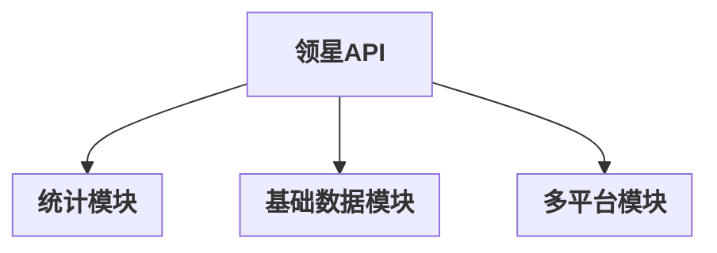
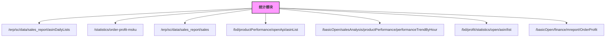

# RPA_Tornado 项目预览

---

## 领星API分组总览




---

## 统计模块接口从属关系



---

## 基础数据模块接口从属关系


---

## 多平台模块接口从属关系

```mermaid
graph TD
    多平台["<b>多平台模块</b>"]
    多平台1["/basicOpen/platformStatisticsV2/saleStat/pageList"]
    多平台2["/basicOpen/platformStatisticsV2/saleStat/pageList/seller-list"]
    多平台3["/bd/profit/statistics/open/msku/list"]
    多平台4["/basicOpen/multiplatform/profit/report/msku"]
    多平台5["/basicOpen/multiplatform/profit/report/sku"]
    多平台6["/multi-platform/sale-statistics-v2"]
    多平台7["/multi-platform/sales-report-asin-daily-lists"]
    多平台8["/multi-platform/order-profit-msku"]
    多平台9["/multi-platform/profit-report-msku"]
    多平台10["/multi-platform/profit-report-sku"]
    多平台11["/multi-platform/seller-list"]
    多平台12["/multi-platform/profit-report-seller"]
    多平台 --> 多平台1
    多平台 --> 多平台2
    多平台 --> 多平台3
    多平台 --> 多平台4
    多平台 --> 多平台5
    多平台 --> 多平台6
    多平台 --> 多平台7
    多平台 --> 多平台8
    多平台 --> 多平台9
    多平台 --> 多平台10
    多平台 --> 多平台11
    多平台 --> 多平台12
    style 多平台 fill:#bfb,stroke:#333,stroke-width:2px
```



---

# RPA_Tornado 项目说明

---

## 一、项目结构

- `app/ecommerce_dashboard/handlers/stat_handler.py`  电商数据看板主接口
- `app/ecommerce_dashboard/services/stat_service.py`  电商数据看板主业务逻辑
- `app/ecommerce_dashboard/services/common.py`        通用API请求工具
- `app/ecommerce_dashboard/routes.py`                 路由注册
- `main.py`                                          启动入口，统一管理所有接口

---

## 二、依赖安装

建议使用虚拟环境：

```bash
python -m venv .venv
.venv\Scripts\activate  # Windows
# source .venv/bin/activate  # Linux/Mac
pip install -r requirements.txt
```

---

## 三、环境配置

请在 `app/config.py` 中配置 API HOST、APP_ID、APP_SECRET 等参数。

---

## 四、项目启动

在项目根目录下执行：

```bash
python RPA_Tornado/main.py
```

启动后访问接口如：
- POST http://127.0.0.1:8888/api/ecommerce/sale_stat

---

## 五、主要接口一览（分组并列：统计、基础数据、多平台）

### 统计
| 路径 | 方法 | 功能简介 | 原始路径 |
|------|------|----------|----------|
| /api/erp/sc/data/sales_report/asinDailyLists | POST | 旧版销量报表ASIN日列表 | /erp/sc/data/sales_report/asinDailyLists |
| /api/statistics/order-profit-msku | POST | 订单利润MSKU查询 | /statistics/order-profit-msku |
| /api/erp/sc/data/sales_report/sales | POST | 查询店铺汇总销量 | /erp/sc/data/sales_report/sales |
| /api/bd/productPerformance/openApi/asinList | POST | 查询产品表现 | /bd/productPerformance/openApi/asinList |
| /api/basicOpen/salesAnalysis/productPerformance/performanceTrendByHour | POST | 查询asin360小时数据 | /basicOpen/salesAnalysis/productPerformance/performanceTrendByHour |
| /api/bd/profit/statistics/open/asin/list | POST | 利润统计-ASIN | /bd/profit/statistics/open/asin/list |
| /api/basicOpen/finance/mreport/OrderProfit | POST | 统计-订单利润MSKU | /basicOpen/finance/mreport/OrderProfit |

### 基础数据
| 路径 | 方法 | 功能简介 | 原始路径 |
|------|------|----------|----------|
| /api/erp/sc/routing/finance/currency/currencyMonth | POST | 查询汇率 | /erp/sc/routing/finance/currency/currencyMonth |
| /api/erp/sc/data/seller/lists | GET | 查询亚马逊店铺列表 | /erp/sc/data/seller/lists |
| /api/erp/sc/data/seller/allMarketplace | GET | 查询亚马逊市场列表 | /erp/sc/data/seller/allMarketplace |
| /api/erp/sc/data/worldState/lists | POST | 查询世界州/省列表 | /erp/sc/data/worldState/lists |
| /api/erp/sc/routing/common/file/download | POST | 下载产品附件 | /erp/sc/routing/common/file/download |
| /api/erp/sc/routing/customized/file/download | POST | 定制化附件下载 | /erp/sc/routing/customized/file/download |
| /api/erp/sc/data/account/lists | GET | 查询ERP用户信息列表 | /erp/sc/data/account/lists |
| /api/erp/sc/data/seller/batchEditSellerName | POST | 批量修改店铺名称 | /erp/sc/data/seller/batchEditSellerName |

### 多平台
| 路径 | 方法 | 功能简介 | 原始路径 |
|------|------|----------|----------|
| /api/basicOpen/platformStatisticsV2/saleStat/pageList | POST | 查询销量统计列表v2 | /basicOpen/platformStatisticsV2/saleStat/pageList |
| /api/basicOpen/platformStatisticsV2/saleStat/pageList/seller-list | POST | 查询多平台店铺基础信息 | /basicOpen/platformStatisticsV2/saleStat/pageList/seller-list |
| /api/bd/profit/statistics/open/msku/list | POST | 多平台订单利润MSKU（兼容老路由） | /bd/profit/statistics/open/msku/list |
| /api/basicOpen/multiplatform/profit/report/msku | POST | 多平台结算利润（利润报表）-msku | /basicOpen/multiplatform/profit/report/msku |
| /api/basicOpen/multiplatform/profit/report/sku | POST | 多平台结算利润（利润报表）-sku | /basicOpen/multiplatform/profit/report/sku |
| /api/multi-platform/sale-statistics-v2 | POST | 多平台销量统计v2（兼容路由） | /basicOpen/platformStatisticsV2/saleStat/pageList |
| /api/multi-platform/sales-report-asin-daily-lists | POST | 多平台ASIN日销量报表 | /basicOpen/platformStatisticsV2/saleStat/pageList |
| /api/multi-platform/order-profit-msku | POST | 多平台订单利润MSKU | /bd/profit/statistics/open/msku/list |
| /api/multi-platform/profit-report-msku | POST | 多平台结算利润（利润报表）-msku | /basicOpen/multiplatform/profit/report/msku |
| /api/multi-platform/profit-report-sku | POST | 多平台结算利润（利润报表）-sku | /basicOpen/multiplatform/profit/report/sku |
| /api/multi-platform/seller-list | POST | 多平台店铺信息查询 | /basicOpen/platformStatisticsV2/saleStat/pageList/seller-list |
| /api/multi-platform/profit-report-seller | POST | 多平台结算利润（利润报表）-店铺 | /basicOpen/multiplatform/profit/report/msku |

---

### 接口映射与限流说明

| API Path（转发路由） | 领星接口路径 | 请求协议 | 请求方式 | 令牌桶容量 | 简要说明 |
|---------------------|----------|----------|----------|------------|----------|
| /api/ecommerce/sale_stat | /basicOpen/platformStatisticsV2/saleStat/pageList | HTTPS | POST | 10 | 电商销售统计 |
| /api/base-data/currency-exchange-rate | /erp/sc/routing/finance/currency/currencyMonth | HTTPS | POST | 10 | 查询汇率 |
| /api/base-data/file-attachment-download | /erp/sc/routing/common/file/download | HTTPS | POST | 10 | 下载产品附件 |
| /api/base-data/customized-file-download | /erp/sc/routing/customized/file/download | HTTPS | POST | 10 | 定制化附件下载 |
| /api/base-data/batch-edit-seller-name | /erp/sc/data/seller/batchEditSellerName | HTTPS | POST | 10 | 批量修改店铺名称 |
| /api/multi-platform/sale-statistics-v2 | /basicOpen/platformStatisticsV2/saleStat/pageList | HTTPS | POST | 10 | 多平台销量统计 |
| /api/multi-platform/sales-report-asin-daily-lists | /basicOpen/platformStatisticsV2/saleStat/pageList | HTTPS | POST | 10 | 多平台ASIN日销量报表 |
| /api/statistics/order-profit-msku | /bd/profit/statistics/open/msku/list | HTTPS | POST | 10 | 订单利润MSKU查询 |
| /api/erp/sc/data/sales_report/asinDailyLists | /erp/sc/data/sales_report/asinDailyLists | HTTPS | POST | 5 | 查询销量、订单量、销售额 |
| ... | ... | ... | ... | ... | ... |

> 说明：如需补充更多接口原路由或限流参数，请参考源码 service 层的 api_request/route_name 字段或联系后端开发。

---

## 六、接口参数与示例（按功能分组）

### 多平台
- 路径：`/api/basicOpen/platformStatisticsV2/saleStat/pageList`  
- 方法：POST
- 原始路由：`/basicOpen/platformStatisticsV2/saleStat/pageList`
- 主要参数：
  | 参数名 | 类型 | 必填 | 说明 | 示例 |
  |--------|------|------|------|------|
  | offset | int | 是 | 分页偏移量，默认0 | 0 |
  | length | int | 是 | 分页长度，默认1000 | 100 |
  | platformCodeS | array | 否 | 平台id数组 | ["10024"] |
  | mids | string | 否 | 国家id，多个用英文逗号分隔 | "NA,MX,BR,US,CA" |
  | sids | string | 否 | 店铺id，多个用英文逗号分隔 | "110424575139430912" |
  | currencyCode | string | 否 | 币种code | "USD" |
  | startDate | string | 是 | 开始时间，Y-m-d | 2024-09-01 |
  | endDate | string | 是 | 结束时间，Y-m-d | 2024-09-30 |
  | searchField | string | 否 | 搜索值类型：msku,local_sku,platform_order_no | "local_sku" |
  | searchValue | string | 否 | 搜索值 | "123" |
  | developers | array | 否 | 开发人 | [128581] |
  | cids | array | 否 | 分类 | [14] |
  | bids | array | 否 | 品牌 | [2] |
- 返回：
```json
{
  "code": 0,
  "message": "success",
  "data": { ... }
}
```

- 路径：`/api/basicOpen/platformStatisticsV2/saleStat/pageList/seller-list`  
- 方法：POST
- 原始路由：`/basicOpen/platformStatisticsV2/saleStat/pageList/seller-list`
- 主要参数：
  | 参数名 | 类型 | 必填 | 说明 | 示例 |
  |--------|------|------|------|------|
  | offset | int | 是 | 分页偏移量，默认0 | 0 |
  | length | int | 是 | 分页长度，默认1000 | 100 |
  | platformCodeS | array | 否 | 平台id数组 | ["10024"] |
  | mids | string | 否 | 国家id，多个用英文逗号分隔 | "NA,MX,BR,US,CA" |
  | sids | string | 否 | 店铺id，多个用英文逗号分隔 | "110424575139430912" |
  | currencyCode | string | 否 | 币种code | "USD" |
  | startDate | string | 是 | 开始时间，Y-m-d | 2024-09-01 |
  | endDate | string | 是 | 结束时间，Y-m-d | 2024-09-30 |
  | searchField | string | 否 | 搜索值类型：msku,local_sku,platform_order_no | "local_sku" |
  | searchValue | string | 否 | 搜索值 | "123" |
  | developers | array | 否 | 开发人 | [128581] |
  | cids | array | 否 | 分类 | [14] |
  | bids | array | 否 | 品牌 | [2] |
- 返回：
```json
{
  "code": 0,
  "message": "success",
  "data": { ... }
}
```

- 路径：`/api/basicOpen/multiplatform/profit/report/msku`
- 方法：POST
- 原始路由：`/api/basicOpen/multiplatform/profit/report/msku`
- 主要参数：
  | 参数名 | 类型 | 必填 | 说明 | 示例 |
  |--------|------|------|------|------|
  | offset | int | 是 | 分页偏移量，默认0 | 0 |
  | length | int | 是 | 分页长度，默认1000 | 100 |
  | platformCodeS | array | 否 | 平台id数组 | ["10024"] |
  | mids | string | 否 | 国家id，多个用英文逗号分隔 | "NA,MX,BR,US,CA" |
  | sids | string | 否 | 店铺id，多个用英文逗号分隔 | "110424575139430912" |
  | currencyCode | string | 否 | 币种code | "USD" |
  | startDate | string | 是 | 开始时间，Y-m-d | 2024-09-01 |
  | endDate | string | 是 | 结束时间，Y-m-d | 2024-09-30 |
  | searchField | string | 否 | 搜索值类型：msku,local_sku,platform_order_no | "local_sku" |
  | searchValue | string | 否 | 搜索值 | "123" |
  | developers | array | 否 | 开发人 | [128581] |
  | cids | array | 否 | 分类 | [14] |
  | bids | array | 否 | 品牌 | [2] |
- 返回：
```json
{
  "code": 0,
  "message": "success",
  "data": { ... }
}
```

- 路径：`/api/basicOpen/multiplatform/profit/report/sku`
- 方法：POST
- 原始路由：`/api/basicOpen/multiplatform/profit/report/sku`
- 主要参数：
  | 参数名 | 类型 | 必填 | 说明 | 示例 |
  |--------|------|------|------|------|
  | offset | int | 是 | 分页偏移量，默认0 | 0 |
  | length | int | 是 | 分页长度，默认1000 | 20 |
  | platformCodeS | array | 否 | 平台id数组 | ["10024"] |
  | mids | string | 是 | 国家id，多个用英文逗号分隔 | "NA,MX,BR,US,CA" |
  | sids | string | 否 | 店铺id，多个用英文逗号分隔 | "110424575139430912" |
  | currencyCode | string | 否 | 币种code | "USD" |
  | startDate | string | 是 | 开始时间，Y-m-d | 2024-09-01 |
  | endDate | string | 是 | 结束时间，Y-m-d | 2024-09-30 |
  | searchField | string | 否 | 搜索值类型：local_sku,platform_order_no | "local_sku" |
  | searchValue | string | 否 | 搜索值 | "123" |
  | developers | array | 否 | 开发人 | [128581] |
  | cids | array | 否 | 分类 | [14] |
  | bids | array | 否 | 品牌 | [2] |
- 返回：
```json
{
  "code": 0,
  "message": "success",
  "data": { ... }
}
```

### 统计
- 路径：`/api/basicOpen/finance/mreport/OrderProfit`
- 方法：POST
- 原始路由：`/basicOpen/finance/mreport/OrderProfit`
- 主要参数：
  | 参数名 | 类型 | 必填 | 说明 | 示例 |
  |--------|------|------|------|------|
  | offset | int | 是 | 分页偏移量，默认0 | 0 |
  | length | int | 是 | 分页长度，默认1000 | 100 |
  | platformCodeS | array | 否 | 平台id数组 | ["10024"] |
  | mids | string | 否 | 国家id，多个用英文逗号分隔 | "NA,MX,BR,US,CA" |
  | sids | string | 否 | 店铺id，多个用英文逗号分隔 | "110424575139430912" |
  | currencyCode | string | 否 | 币种code | "USD" |
  | startDate | string | 是 | 开始时间，Y-m-d | 2024-09-01 |
  | endDate | string | 是 | 结束时间，Y-m-d | 2024-09-30 |
  | searchField | string | 否 | 搜索值类型：msku,local_sku,platform_order_no | "local_sku" |
  | searchValue | string | 否 | 搜索值 | "123" |
  | developers | array | 否 | 开发人 | [128581] |
  | cids | array | 否 | 分类 | [14] |
  | bids | array | 否 | 品牌 | [2] |
- 返回：
```json
{
  "code": 0,
  "message": "success",
  "data": { ... }
}
```

- 路径：`/api/bd/profit/statistics/open/msku/list`
- 方法：POST
- 原始路由：`/bd/profit/statistics/open/msku/list`
- 主要参数：
  | 参数名 | 类型 | 必填 | 说明 | 示例 |
  |--------|------|------|------|------|
  | offset | int | 是 | 分页偏移量，默认0 | 0 |
  | length | int | 是 | 分页长度，默认1000 | 100 |
  | platformCodeS | array | 否 | 平台id数组 | ["10024"] |
  | mids | string | 否 | 国家id，多个用英文逗号分隔 | "NA,MX,BR,US,CA" |
  | sids | string | 否 | 店铺id，多个用英文逗号分隔 | "110424575139430912" |
  | currencyCode | string | 否 | 币种code | "USD" |
  | startDate | string | 是 | 开始时间，Y-m-d | 2024-09-01 |
  | endDate | string | 是 | 结束时间，Y-m-d | 2024-09-30 |
  | searchField | string | 否 | 搜索值类型：msku,local_sku,platform_order_no | "local_sku" |
  | searchValue | string | 否 | 搜索值 | "123" |
  | developers | array | 否 | 开发人 | [128581] |
  | cids | array | 否 | 分类 | [14] |
  | bids | array | 否 | 品牌 | [2] |
- 返回：
```json
{
  "code": 0,
  "message": "success",
  "data": { ... }
}
```

- 路径：`/api/statistics/order-profit-msku`
- 方法：POST
- 原始路由：`/statistics/order-profit-msku`
- 主要参数：
  | 参数名 | 类型 | 必填 | 说明 | 示例 |
  |--------|------|------|------|------|
  | offset | int | 是 | 分页偏移量，默认0 | 0 |
  | length | int | 是 | 分页长度，默认1000 | 100 |
  | platformCodeS | array | 否 | 平台id数组 | ["10024"] |
  | mids | string | 否 | 国家id，多个用英文逗号分隔 | "NA,MX,BR,US,CA" |
  | sids | string | 否 | 店铺id，多个用英文逗号分隔 | "110424575139430912" |
  | currencyCode | string | 否 | 币种code | "USD" |
  | startDate | string | 是 | 开始时间，Y-m-d | 2024-09-01 |
  | endDate | string | 是 | 结束时间，Y-m-d | 2024-09-30 |
  | searchField | string | 否 | 搜索值类型：msku,local_sku,platform_order_no | "local_sku" |
  | searchValue | string | 否 | 搜索值 | "123" |
  | developers | array | 否 | 开发人 | [128581] |
  | cids | array | 否 | 分类 | [14] |
  | bids | array | 否 | 品牌 | [2] |
- 返回：
```json
{
  "code": 0,
  "message": "success",
  "data": { ... }
}
```

- 路径：`/api/statistics/sales-report-asin-daily-lists`
- 方法：POST
- 原始路由：`/statistics/sales-report-asin-daily-lists`
- 主要参数：
  | 参数名 | 类型 | 必填 | 说明 | 示例 |
  |--------|------|------|------|------|
  | offset | int | 是 | 分页偏移量，默认0 | 0 |
  | length | int | 是 | 分页长度，默认1000 | 100 |
  | platformCodeS | array | 否 | 平台id数组 | ["10024"] |
  | mids | string | 否 | 国家id，多个用英文逗号分隔 | "NA,MX,BR,US,CA" |
  | sids | string | 否 | 店铺id，多个用英文逗号分隔 | "110424575139430912" |
  | currencyCode | string | 否 | 币种code | "USD" |
  | startDate | string | 是 | 开始时间，Y-m-d | 2024-09-01 |
  | endDate | string | 是 | 结束时间，Y-m-d | 2024-09-30 |
  | searchField | string | 否 | 搜索值类型：msku,local_sku,platform_order_no | "local_sku" |
  | searchValue | string | 否 | 搜索值 | "123" |
  | developers | array | 否 | 开发人 | [128581] |
  | cids | array | 否 | 分类 | [14] |
  | bids | array | 否 | 品牌 | [2] |
- 返回：
```json
{
  "code": 0,
  "message": "success",
  "data": { ... }
}
```

### 基础数据
- 路径：`/api/erp/sc/routing/finance/currency/currencyMonth`
- 方法：POST
- 原始路由：`/erp/sc/routing/finance/currency/currencyMonth`
- 主要参数：
  | 参数名 | 类型 | 必填 | 说明 | 示例 |
  |--------|------|------|------|------|
  | date | string | 否 | 汇率月份，格式YYYY-MM | 2023-08 |
- 返回：
```json
{
  "code": 0,
  "message": "success",
  "data": { ... }
}
```

- 路径：`/api/erp/sc/data/seller/lists`
- 方法：GET
- 原始路由：`/erp/sc/data/seller/lists`
- 主要参数：
  | 参数名 | 类型 | 必填 | 说明 | 示例 |
  |--------|------|------|------|------|
  | offset | int | 是 | 分页偏移量，默认0 | 0 |
  | length | int | 是 | 分页长度，默认1000 | 100 |
  | platformCodeS | array | 否 | 平台id数组 | ["10024"] |
  | mids | string | 否 | 国家id，多个用英文逗号分隔 | "NA,MX,BR,US,CA" |
  | sids | string | 否 | 店铺id，多个用英文逗号分隔 | "110424575139430912" |
  | currencyCode | string | 否 | 币种code | "USD" |
  | startDate | string | 是 | 开始时间，Y-m-d | 2024-09-01 |
  | endDate | string | 是 | 结束时间，Y-m-d | 2024-09-30 |
  | searchField | string | 否 | 搜索值类型：msku,local_sku,platform_order_no | "local_sku" |
  | searchValue | string | 否 | 搜索值 | "123" |
  | developers | array | 否 | 开发人 | [128581] |
  | cids | array | 否 | 分类 | [14] |
  | bids | array | 否 | 品牌 | [2] |
- 返回：
```json
{
  "code": 0,
  "message": "success",
  "data": { ... }
}
```

- 路径：`/api/erp/sc/data/seller/allMarketplace`
- 方法：GET
- 原始路由：`/erp/sc/data/seller/allMarketplace`
- 主要参数：
  | 参数名 | 类型 | 必填 | 说明 | 示例 |
  |--------|------|------|------|------|
  | offset | int | 是 | 分页偏移量，默认0 | 0 |
  | length | int | 是 | 分页长度，默认1000 | 100 |
  | platformCodeS | array | 否 | 平台id数组 | ["10024"] |
  | mids | string | 否 | 国家id，多个用英文逗号分隔 | "NA,MX,BR,US,CA" |
  | sids | string | 否 | 店铺id，多个用英文逗号分隔 | "110424575139430912" |
  | currencyCode | string | 否 | 币种code | "USD" |
  | startDate | string | 是 | 开始时间，Y-m-d | 2024-09-01 |
  | endDate | string | 是 | 结束时间，Y-m-d | 2024-09-30 |
  | searchField | string | 否 | 搜索值类型：msku,local_sku,platform_order_no | "local_sku" |
  | searchValue | string | 否 | 搜索值 | "123" |
  | developers | array | 否 | 开发人 | [128581] |
  | cids | array | 否 | 分类 | [14] |
  | bids | array | 否 | 品牌 | [2] |
- 返回：
```json
{
  "code": 0,
  "message": "success",
  "data": { ... }
}
```

- 路径：`/api/erp/sc/data/worldState/lists`
- 方法：POST
- 原始路由：`/erp/sc/data/worldState/lists`
- 主要参数：
  | 参数名 | 类型 | 必填 | 说明 | 示例 |
  |--------|------|------|------|------|
  | offset | int | 是 | 分页偏移量，默认0 | 0 |
  | length | int | 是 | 分页长度，默认1000 | 100 |
  | platformCodeS | array | 否 | 平台id数组 | ["10024"] |
  | mids | string | 否 | 国家id，多个用英文逗号分隔 | "NA,MX,BR,US,CA" |
  | sids | string | 否 | 店铺id，多个用英文逗号分隔 | "110424575139430912" |
  | currencyCode | string | 否 | 币种code | "USD" |
  | startDate | string | 是 | 开始时间，Y-m-d | 2024-09-01 |
  | endDate | string | 是 | 结束时间，Y-m-d | 2024-09-30 |
  | searchField | string | 否 | 搜索值类型：msku,local_sku,platform_order_no | "local_sku" |
  | searchValue | string | 否 | 搜索值 | "123" |
  | developers | array | 否 | 开发人 | [128581] |
  | cids | array | 否 | 分类 | [14] |
  | bids | array | 否 | 品牌 | [2] |
- 返回：
```json
{
  "code": 0,
  "message": "success",
  "data": { ... }
}
```

- 路径：`/api/erp/sc/routing/common/file/download`
- 方法：POST
- 原始路由：`/erp/sc/routing/common/file/download`
- 主要参数：
  | 参数名 | 类型 | 必填 | 说明 | 示例 |
  |--------|------|------|------|------|
  | offset | int | 是 | 分页偏移量，默认0 | 0 |
  | length | int | 是 | 分页长度，默认1000 | 100 |
  | platformCodeS | array | 否 | 平台id数组 | ["10024"] |
  | mids | string | 否 | 国家id，多个用英文逗号分隔 | "NA,MX,BR,US,CA" |
  | sids | string | 否 | 店铺id，多个用英文逗号分隔 | "110424575139430912" |
  | currencyCode | string | 否 | 币种code | "USD" |
  | startDate | string | 是 | 开始时间，Y-m-d | 2024-09-01 |
  | endDate | string | 是 | 结束时间，Y-m-d | 2024-09-30 |
  | searchField | string | 否 | 搜索值类型：msku,local_sku,platform_order_no | "local_sku" |
  | searchValue | string | 否 | 搜索值 | "123" |
  | developers | array | 否 | 开发人 | [128581] |
  | cids | array | 否 | 分类 | [14] |
  | bids | array | 否 | 品牌 | [2] |
- 返回：
```json
{
  "code": 0,
  "message": "success",
  "data": { ... }
}
```

- 路径：`/api/erp/sc/routing/customized/file/download`
- 方法：POST
- 原始路由：`/erp/sc/routing/customized/file/download`
- 主要参数：
  | 参数名 | 类型 | 必填 | 说明 | 示例 |
  |--------|------|------|------|------|
  | offset | int | 是 | 分页偏移量，默认0 | 0 |
  | length | int | 是 | 分页长度，默认1000 | 20 |
  | platformCodeS | array | 否 | 平台id数组 | ["10024"] |
  | mids | string | 是 | 国家id，多个用英文逗号分隔 | "NA,MX,BR,US,CA" |
  | sids | string | 否 | 店铺id，多个用英文逗号分隔 | "110424575139430912" |
  | currencyCode | string | 否 | 币种code | "USD" |
  | startDate | string | 是 | 开始时间，Y-m-d | 2024-09-01 |
  | endDate | string | 是 | 结束时间，Y-m-d | 2024-09-30 |
  | searchField | string | 否 | 搜索值类型：local_sku,platform_order_no | "local_sku" |
  | searchValue | string | 否 | 搜索值 | "123" |
  | developers | array | 否 | 开发人 | [128581] |
  | cids | array | 否 | 分类 | [14] |
  | bids | array | 否 | 品牌 | [2] |
- 返回：
```json
{
  "code": 0,
  "message": "success",
  "data": { ... }
}
```

- 路径：`/api/erp/sc/data/account/lists`
- 方法：GET
- 原始路由：`/erp/sc/data/account/lists`
- 主要参数：
  | 参数名 | 类型 | 必填 | 说明 | 示例 |
  |--------|------|------|------|------|
  | offset | int | 是 | 分页偏移量，默认0 | 0 |
  | length | int | 是 | 分页长度，默认1000 | 100 |
  | platformCodeS | array | 否 | 平台id数组 | ["10024"] |
  | mids | string | 否 | 国家id，多个用英文逗号分隔 | "NA,MX,BR,US,CA" |
  | sids | string | 否 | 店铺id，多个用英文逗号分隔 | "110424575139430912" |
  | currencyCode | string | 否 | 币种code | "USD" |
  | startDate | string | 是 | 开始时间，Y-m-d | 2024-09-01 |
  | endDate | string | 是 | 结束时间，Y-m-d | 2024-09-30 |
  | searchField | string | 否 | 搜索值类型：msku,local_sku,platform_order_no | "local_sku" |
  | searchValue | string | 否 | 搜索值 | "123" |
  | developers | array | 否 | 开发人 | [128581] |
  | cids | array | 否 | 分类 | [14] |
  | bids | array | 否 | 品牌 | [2] |
- 返回：
```json
{
  "code": 0,
  "message": "success",
  "data": { ... }
}
```

- 路径：`/api/erp/sc/data/sales_report/sales`
- 方法：POST
- 原始路由：`/erp/sc/data/sales_report/sales`
- 主要参数：
  | 参数名 | 类型 | 必填 | 说明 | 示例 |
  |--------|------|------|------|------|
  | sid | array(int) | 是 | 店铺id数组 | [109] |
  | start_date | string | 是 | 报表开始时间，Y-m-d | 2020-01-01 |
  | end_date | string | 是 | 报表结束时间，Y-m-d | 2024-08-05 |
  | offset | int | 否 | 分页偏移量，默认0 | 0 |
  | length | int | 否 | 分页长度，默认1000 | 1000 |
- 返回：
```json
{
  "code": 0,
  "message": "success",
  "data": { ... }
}
```

- 路径：`/api/bd/productPerformance/openApi/asinList`
- 方法：POST
- 原始路径：`/bd/productPerformance/openApi/asinList`
- 主要参数：
  | 参数名 | 说明 | 必填 | 类型 | 示例 |
  |--------|------|------|------|------|
  | offset | 分页偏移量 | 是 | int | 0 |
  | length | 分页长度，最大10000 | 是 | int | 20 |
  | sort_field | 排序字段，只支持下列字段 | 是 | string | volume |
  | sort_type | 排序方式：desc/asc，默认desc | 是 | string | desc |
  | search_field | 搜索字段，只支持下列字段 | 否 | string | asin |
  | search_value | 搜索值，最多50个 | 否 | array | ["B085M7NH7K"] |
  | mid | 站点id | 否 | int | 1 |
  | sid | 店铺id，上限200，字符串或数组 | 是 | str/array | [1,109] |
  | start_date | 开始日期，Y-m-d | 是 | string | 2024-08-01 |
  | end_date | 结束日期，Y-m-d | 是 | string | 2024-08-07 |
  | extend_search | 表头筛选，见下 | 否 | array | - |
  | summary_field | 汇总行维度，只支持下列字段 | 是 | string | asin |
  | currency_code | 货币类型，不传为原币种 | 否 | string | CNY |
  | is_recently_enum | 是否仅查询活跃商品，true/false | 否 | boolean | true |

- sort_field 可选值：
  volume, order_items, amount, volume_chain_ratio, order_chain_ratio, amount_chain_ratio, b2b_volume, b2b_order_items, promotion_volume, promotion_amount, promotion_order_items, promotion_discount, avg_volume

- search_field 可选值：asin, parent_asin, msku, local_sku, item_name

- summary_field 可选值：asin, parent_asin, msku, sku

- extend_search 为对象数组，每项包含：
  - field: 同 sort_field 可选值
  - from_value: int
  - to_value: int
  - exp: range、gt、lt、ge、le、eq

- 返回：
```json
{
  "code": 0,
  "message": "success",
  "data": { ... }
}
```

- 路径：`/api/basicOpen/salesAnalysis/productPerformance/performanceTrendByHour`
- 方法：POST
- 原始路由：`/basicOpen/salesAnalysis/productPerformance/performanceTrendByHour`
- 主要参数：
  | 参数名 | 类型 | 必填 | 说明 | 示例 |
  |--------|------|------|------|------|
  | sids | string | 是 | 店铺id，多个用英文逗号隔开，最大200 | "136,139" |
  | date_start | string | 是 | 开始时间，Y-m-d | 2024-09-24 |
  | date_end | string | 是 | 结束时间，Y-m-d | 2024-09-24 |
  | summary_field | string | 是 | 查询维度：parent_asin/asin/msku/sku/spu | spu |
  | summary_field_value | string | 是 | 查询维度值 | 10886 |
- 返回：
```json
{
  "code": 0,
  "message": "success",
  "data": { ... }
}
```

- 路径：`/api/bd/profit/statistics/open/asin/list`
- 方法：POST
- 原始路由：`/api/bd/profit/statistics/open/asin/list`
- 主要参数：
  | 参数名 | 类型 | 必填 | 说明 | 示例 |
  |--------|------|------|------|------|
  | offset | int | 否 | 分页偏移量 | 0 |
  | length | int | 否 | 分页长度，上限10000 | 1000 |
  | mids | array | 否 | 站点id | [2] |
  | sids | array | 否 | 店铺id | [17] |
  | startDate | string | 是 | 开始时间，Y-m-d，间隔不超过7天 | 2022-09-21 |
  | endDate | string | 是 | 结束时间，Y-m-d，间隔不超过7天 | 2022-09-25 |
  | searchField | string | 否 | 搜索值类型，asin | asin |
  | searchValue | array | 否 | 搜索值 | ["B07DFKF00SG"] |
  | currencyCode | string | 否 | 币种code | CNY |
- 返回：
```json
{
  "code": 0,
  "message": "success",
  "data": { ... }
}
```

### 基础数据
- 路径：`/api/erp/sc/data/seller/batchEditSellerName`
- 方法：POST
- 原始路径：`/erp/sc/data/seller/batchEditSellerName`
- 主要参数：
  | 参数名 | 类型 | 必填 | 说明 | 示例 |
  |--------|------|------|------|------|
  | sid_name_list | array | 是 | 包含 sid 和 name 的字典数组 | [{"sid": 1, "name": "新店铺名"}] |
- 返回：
```json
{
  "code": 0,
  "message": "success",
  "data": { ... }
}
```

- 路径：`/api/erp/sc/data/seller/allMarketplace`
- 方法：GET
- 原始路径：`/erp/sc/data/seller/allMarketplace`
- 主要参数：
  | 参数名 | 类型 | 必填 | 说明 | 示例 |
  |--------|------|------|------|------|
  | offset | int | 是 | 分页偏移量，默认0 | 0 |
  | length | int | 是 | 分页长度，默认1000 | 100 |
  | 其余参数同 /api/erp/sc/data/seller/lists |
- 返回：
```json
{
  "code": 0,
  "message": "success",
  "data": { ... }
}
```

- 路径：`/api/erp/sc/data/account/lists`
- 方法：GET
- 原始路径：`/erp/sc/data/account/lists`
- 主要参数：
  | 参数名 | 类型 | 必填 | 说明 | 示例 |
  |--------|------|------|------|------|
  | offset | int | 是 | 分页偏移量，默认0 | 0 |
  | length | int | 是 | 分页长度，默认1000 | 100 |
  | 其余参数同 /api/erp/sc/data/seller/lists |
- 返回：
```json
{
  "code": 0,
  "message": "success",
  "data": { ... }
}
```

- 路径：`/api/erp/sc/data/worldState/lists`
- 方法：POST
- 原始路径：`/erp/sc/data/worldState/lists`
- 主要参数：
  | 参数名 | 类型 | 必填 | 说明 | 示例 |
  |--------|------|------|------|------|
  | country_code | string | 是 | 国家代码 | "US" |
- 返回：
```json
{
  "code": 0,
  "message": "success",
  "data": { ... }
}
```

- 路径：`/api/erp/sc/routing/common/file/download`
- 方法：POST
- 原始路径：`/erp/sc/routing/common/file/download`
- 主要参数：
  | 参数名 | 类型 | 必填 | 说明 | 示例 |
  |--------|------|------|------|------|
  | file_id | string | 是 | 文件ID | "abc123" |
- 返回：
```json
{
  "code": 0,
  "message": "success",
  "data": { ... }
}
```

- 路径：`/api/erp/sc/routing/customized/file/download`
- 方法：POST
- 原始路径：`/erp/sc/routing/customized/file/download`
- 主要参数：
  | 参数名 | 类型 | 必填 | 说明 | 示例 |
  |--------|------|------|------|------|
  | file_id | string | 是 | 文件ID | "abc123" |
- 返回：
```json
{
  "code": 0,
  "message": "success",
  "data": { ... }
}
```

### 统计
- 路径：`/api/erp/sc/data/sales_report/asinDailyLists`
- 方法：POST
- 原始路径：`/erp/sc/data/sales_report/asinDailyLists`
- 主要参数：
  | 参数名 | 类型 | 必填 | 说明 | 示例 |
  |--------|------|------|------|------|
  | offset | int | 否 | 分页偏移量，默认0 | 0 |
  | length | int | 否 | 分页长度，默认1000 | 1000 |
  | 其余参数同 /api/statistics/order-profit-msku |
- 返回：
```json
{
  "code": 0,
  "message": "success",
  "data": { ... }
}
```

- 路径：`/api/erp/sc/data/sales_report/sales`
- 方法：POST
- 原始路径：`/erp/sc/data/sales_report/sales`
- 主要参数：
  | 参数名 | 类型 | 必填 | 说明 | 示例 |
  |--------|------|------|------|------|
  | sid | array(int) | 是 | 店铺id数组 | [109] |
  | start_date | string | 是 | 报表开始时间，Y-m-d | 2020-01-01 |
  | end_date | string | 是 | 报表结束时间，Y-m-d | 2024-08-05 |
  | offset | int | 否 | 分页偏移量，默认0 | 0 |
  | length | int | 否 | 分页长度，默认1000 | 1000 |
- 返回：
```json
{
  "code": 0,
  "message": "success",
  "data": { ... }
}
```

### 多平台
- 路径：`/api/multi-platform/sale-statistics-v2`
- 方法：POST
- 原始路径：`/basicOpen/platformStatisticsV2/saleStat/pageList`
- 主要参数：参数同 `/api/basicOpen/platformStatisticsV2/saleStat/pageList`
- 返回：
```json
{
  "code": 0,
  "message": "success",
  "data": { ... }
}
```

- 路径：`/api/multi-platform/sales-report-asin-daily-lists`
- 方法：POST
- 原始路径：`/basicOpen/platformStatisticsV2/saleStat/pageList`
- 主要参数：参数同 `/api/basicOpen/platformStatisticsV2/saleStat/pageList`
- 返回：
```json
{
  "code": 0,
  "message": "success",
  "data": { ... }
}
```

- 路径：`/api/multi-platform/order-profit-msku`
- 方法：POST
- 原始路径：`/bd/profit/statistics/open/msku/list`
- 主要参数：参数同 `/api/bd/profit/statistics/open/msku/list`
- 返回：
```json
{
  "code": 0,
  "message": "success",
  "data": { ... }
}
```

- 路径：`/api/multi-platform/profit-report-msku`
- 方法：POST
- 原始路径：`/basicOpen/multiplatform/profit/report/msku`
- 主要参数：参数同 `/api/basicOpen/multiplatform/profit/report/msku`
- 返回：
```json
{
  "code": 0,
  "message": "success",
  "data": { ... }
}
```

- 路径：`/api/multi-platform/profit-report-sku`
- 方法：POST
- 原始路径：`/basicOpen/multiplatform/profit/report/sku`
- 主要参数：参数同 `/api/basicOpen/multiplatform/profit/report/sku`
- 返回：
```json
{
  "code": 0,
  "message": "success",
  "data": { ... }
}
```

- 路径：`/api/multi-platform/seller-list`
- 方法：POST
- 原始路径：`/basicOpen/platformStatisticsV2/saleStat/pageList/seller-list`
- 主要参数：参数同 `/api/basicOpen/platformStatisticsV2/saleStat/pageList/seller-list`
- 返回：
```json
{
  "code": 0,
  "message": "success",
  "data": { ... }
}
```

- 路径：`/api/multi-platform/profit-report-seller`
- 方法：POST
- 原始路径：`/basicOpen/multiplatform/profit/report/msku`
- 主要参数：参数同 `/api/basicOpen/multiplatform/profit/report/msku`
- 返回：
```json
{
  "code": 0,
  "message": "success",
  "data": { ... }
}
```

---

## 七、测试

运行测试用例：
```bash
pytest RPA_Tornado/tests/test_ecommerce_dashboard.py -s
```

---

## 八、扩展说明

如有更多子项目或接口需求，建议仿照本结构扩展即可。

---

> 文档自动生成自 swagger.yaml，详细参数和返回结构请参考 swagger 文件或源码注释。 
