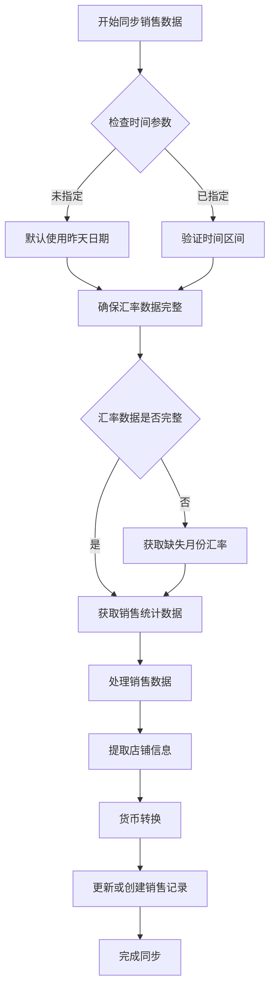

# 电商数据看板数据库系统

## 系统概述

这是一个完整的电商数据管理系统，用于同步和管理店铺数据、汇率数据和销售数据。系统支持多货币转换、时间区间查询和自动汇率更新。

## 主要功能

### 1. 店铺数据管理
- 自动同步店铺信息（店铺ID、平台ID、店铺名称、平台名称）
- 支持店铺信息的更新和维护
- 建立店铺与销售数据的关联关系

### 2. 汇率数据管理
- 自动获取和同步多种货币的汇率数据
- 支持按月份更新汇率数据
- 提供汇率查询和转换功能

### 3. 销售数据管理
- **核心功能**：支持指定时间区间的销售数据同步
- 自动货币转换（支持转换为人民币和美元）
- 智能汇率检查和补充
- 数据去重和更新机制

## 数据库表结构

### shops 表（店铺信息）
- `shop_id`: 店铺唯一标识符（主键）
- `platform_id`: 平台ID
- `shop_name`: 店铺名称
- `platform`: 平台名称
- `created_at`: 创建时间
- `updated_at`: 更新时间

### sales 表（销售记录）
- `sale_id`: 销售记录ID（自增主键）
- `shop_id`: 关联的店铺ID（外键）
- `sale_date`: 销售日期
- `cny_amount`: 人民币金额
- `usd_amount`: 美元金额
- `entry_time`: 记录创建时间

### exchange_rate 表（汇率信息）
- `id`: 主键ID
- `date`: 汇率日期
- `currency_code`: 货币代码
- `currency_icon`: 货币图标
- `currency_name`: 货币名称
- `user_rate`: 用户设置的汇率值
- `update_time`: 更新时间
- `org_rate`: 原始汇率值

## 核心方法说明

### 1. sync_sales_data_with_period()
**进阶版销售数据同步方法**

```python
sync_sales_data_with_period(db_manager, start_date=None, end_date=None)
```

**功能特点：**
- 支持指定开始时间和结束时间（左右闭区间）
- 默认获取昨天的数据（如果不指定时间）
- 自动检查和补充缺失的汇率数据
- 跨月份时自动更新不存在的月份汇率数据

**参数说明：**
- `start_date`: 开始日期（可选，默认为昨天）
- `end_date`: 结束日期（可选，默认为昨天）

### 2. convert_currency()
**货币转换静态方法**

```python
@staticmethod
convert_currency(amount, from_currency, to_currency, exchange_rate, usd_rate=None)
```

**功能：**
- 支持任意货币转换为人民币或美元
- 自动处理汇率计算逻辑
- 支持多级转换（其他货币 → 人民币 → 美元）

### 3. ensure_exchange_rates_for_period()
**汇率数据完整性检查方法**

```python
@staticmethod
ensure_exchange_rates_for_period(db_manager, start_date, end_date)
```

**功能：**
- 检查指定时间区间内的汇率数据完整性
- 自动获取缺失月份的汇率数据
- 确保销售数据同步前汇率数据可用

## 数据处理逻辑

### 销售数据处理流程



### 数据提取逻辑

1. **店铺ID提取**：从API返回的 `$..sid[0]` 路径提取店铺ID
2. **销售日期和金额**：从 `$..date_collect` 提取键值对格式的日期和金额
3. **货币代码**：从 `$..currency_code` 提取货币类型
4. **货币转换**：根据汇率将原始金额转换为人民币和美元

## 使用示例

### 基本使用
```python
from manage_data import DatabaseManager, GetData
from datetime import date, timedelta

# 创建数据库管理器
db_manager = DatabaseManager()

# 同步昨天的销售数据（默认）
GetData.sync_sales_data_with_period(db_manager)

# 同步指定日期的销售数据
target_date = date(2025, 8, 5)
GetData.sync_sales_data_with_period(db_manager, target_date, target_date)

# 同步最近三天的销售数据
end_date = date.today() - timedelta(days=1)  # 昨天
start_date = end_date - timedelta(days=2)    # 三天前
GetData.sync_sales_data_with_period(db_manager, start_date, end_date)
```

### 货币转换示例
```python
# 转换100美元为人民币
cny_amount = GetData.convert_currency("100", "USD", "CNY", usd_rate_record)

# 转换1000人民币为美元
usd_amount = GetData.convert_currency("1000", "CNY", "USD", None, usd_rate_record)
```

## 错误处理

系统包含完善的错误处理机制：

1. **数据格式验证**：检查API返回数据的格式和完整性
2. **汇率数据检查**：确保所需汇率数据存在
3. **数据库事务**：使用事务确保数据一致性
4. **异常日志**：详细记录处理过程中的错误信息

## 性能优化

1. **批量处理**：按店铺批量提交销售记录
2. **数据去重**：基于店铺ID和销售日期的唯一约束
3. **索引优化**：在关键字段上建立索引
4. **连接池**：使用SQLAlchemy连接池管理数据库连接

## 注意事项

1. **时间区间**：支持左右闭区间，即包含开始日期和结束日期
2. **汇率依赖**：销售数据同步前会自动检查和补充汇率数据
3. **数据更新**：相同店铺和日期的销售记录会被更新而不是重复创建
4. **货币精度**：使用Decimal类型确保货币计算的精度

## 文件说明

- `manage_data.py`: 主要的数据管理模块
- `fix_table_structure.py`: 数据库表结构修复工具
- `sales_sync_flowchart.md`: 销售数据同步流程图
- `README.md`: 系统说明文档

## 系统要求

- Python 3.7+
- PostgreSQL 数据库
- SQLAlchemy 2.0+
- psycopg2-binary
- requests
- jsonpath-ng

## 运行方式

```bash
# 运行主程序（包含测试代码）
python manage_data.py

# 修复数据库表结构（如需要）
python fix_table_structure.py
```