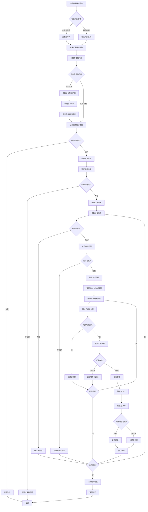
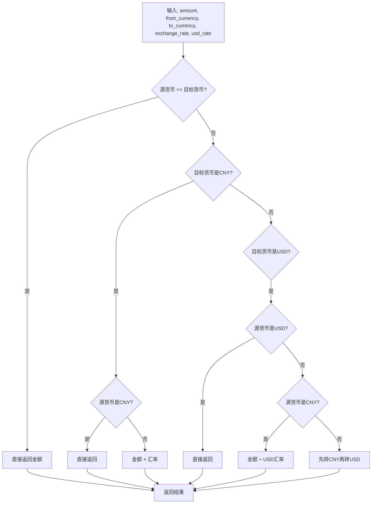
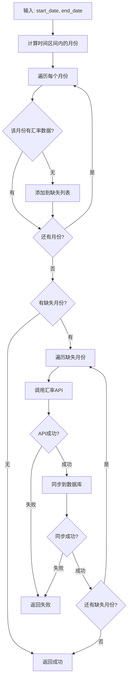

# 销售数据同步流程图

## 完整的销售数据同步逻辑



## 关键组件说明

### 1. 货币转换方法 (convert_currency)


### 2. 汇率检查方法 (ensure_exchange_rates_for_period)


## 数据流说明

### 输入数据结构
```json
{
  "code": 0,
  "data": {
    "list": [
      {
        "sid": "店铺ID",
        "currency_code": "货币代码",
        "date_collect": {
          "2025-01-01": "1000.00",
          "2025-01-02": "1500.00"
        }
      }
    ]
  }
}
```

### 数据库表关系
- `shops.shop_id` ↔ `sales.shop_id` (外键关系)
- `sales` 表存储转换后的 `cny_amount` 和 `usd_amount`
- `exchange_rate` 表提供货币转换汇率

### 错误处理策略
1. **数据验证**: 检查必要字段存在性
2. **汇率缺失**: 自动获取缺失月份的汇率数据
3. **店铺不存在**: 记录警告但继续处理其他店铺
4. **日期格式错误**: 跳过该条记录但继续处理
5. **货币转换失败**: 记录错误并跳过该条记录

### 性能优化
1. **批量处理**: 按店铺分组提交事务
2. **汇率缓存**: 预先检查并获取所需汇率数据
3. **增量更新**: 只处理指定时间区间内的数据
4. **错误恢复**: 单条记录失败不影响整体处理