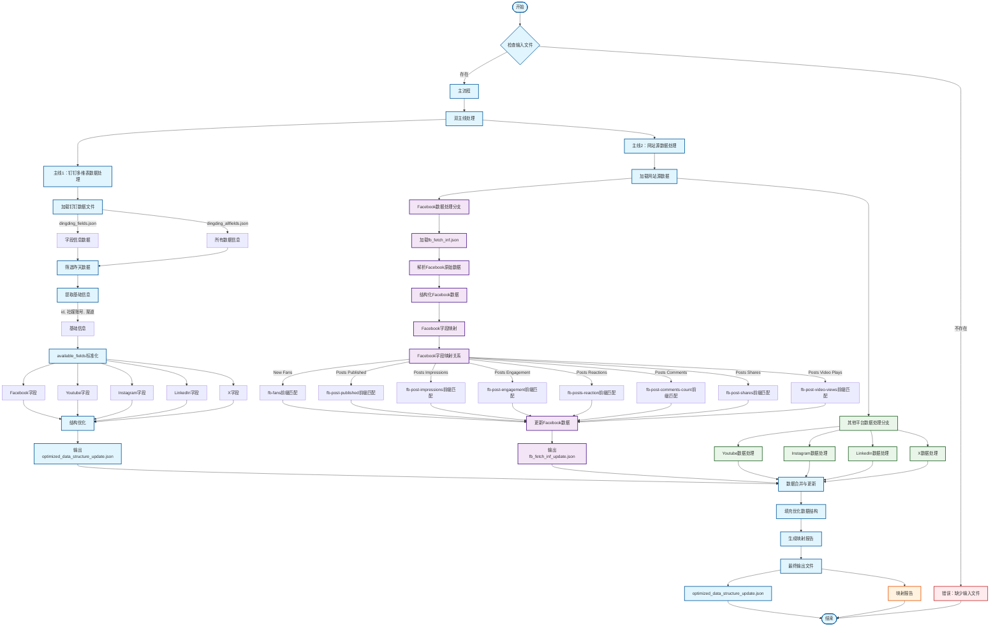

# 数据处理流程图



## 流程说明

### 双主线处理
1. **主线1：钉钉多维表数据处理**
   - 输入：`dingding_fields.json` 和 `dingding_allfields.json`
   - 处理：筛选昨天数据，提取基础信息，标准化字段
   - 输出：`optimized_data_structure_update.json`

2. **主线2：网站源数据处理**
   - 输入：各网站源数据文件（如 `fb_fetch_inf.json`）
   - 处理：解析原始数据，字段映射，数据更新
   - 输出：更新后的数据结构

### Facebook分支处理详情
- **数据加载**：从 `fb_fetch_inf.json` 加载原始数据
- **数据解析**：结构化Facebook原始数据
- **字段映射**：使用前缀模糊匹配和jsonpath模板
- **数据更新**：将映射后的数据填充到优化结构中

### 其他平台分支（预留）
- Youtube数据处理分支
- Instagram数据处理分支
- LinkedIn数据处理分支
- X数据处理分支

### 最终输出
- `optimized_data_structure_update.json`：包含所有平台数据的最终优化结构
- 映射报告：统计映射成功率和详细映射关系

---

## 伪代码设计

### 主程序入口
```pseudocode
FUNCTION main()
    // 检查输入文件是否存在
    IF check_input_files() == FALSE
        PRINT "错误：缺少必要的输入文件"
        RETURN
    
    // 执行双主线处理
    optimized_data = process_dingding_data()  // 主线1
    source_data = process_source_data()       // 主线2
    
    // 合并数据并输出
    final_data = merge_and_fill_data(optimized_data, source_data)
    generate_mapping_report(final_data)
    save_final_output(final_data)
END FUNCTION
```

### 主线1：钉钉多维表数据处理
```pseudocode
FUNCTION process_dingding_data()
    // 加载钉钉数据文件
    fields_data = load_json_file("dingding_fields.json")
    allfields_data = load_json_file("dingding_allfields.json")
    
    // 筛选昨天数据
    yesterday_data = filter_yesterday_data(allfields_data)
    
    // 提取基础信息
    basic_info = extract_basic_info(yesterday_data)
    
    // 标准化available_fields
    standardized_fields = standardize_available_fields(basic_info)
    
    // 结构优化
    optimized_structure = create_optimized_structure(standardized_fields)
    
    // 输出优化结构
    save_json_file("optimized_data_structure_update.json", optimized_structure)
    
    RETURN optimized_structure
END FUNCTION

FUNCTION standardize_available_fields(basic_info)
    FOR EACH record IN basic_info
        SWITCH record.channel
            CASE "FaceBook"
                record.available_fields = [
                    "New Fans", "Posts Published", "Posts Impressions",
                    "Posts Engagement", "Posts Reactions", "Posts Comments",
                    "Posts Shares", "Posts Video Plays"
                ]
            CASE "Youtube"
                record.available_fields = [
                    "Total Subscribers", "Subscribers Gained", "Engagement",
                    "Views", "Post"
                ]
            CASE "Instagram"
                record.available_fields = [
                    "Total Followers", "Total Interactions", "Total Views",
                    "Total Reach", "Post Published"
                ]
            CASE "LinkedIn"
                record.available_fields = [
                    "Total Followers-linkedin", "Total Posts", "Follower Growth",
                    "Total Impressions", "Total Page Likes", "Total Page Clicks"
                ]
            CASE "X"
                record.available_fields = [
                    "Followers", "Following", "Total Tweets"
                ]
        END SWITCH
    END FOR
    RETURN basic_info
END FUNCTION
```

### 主线2：网站源数据处理
```pseudocode
FUNCTION process_source_data()
    // 加载网站源数据
    source_files = get_source_files()
    
    FOR EACH file IN source_files
        IF file.type == "facebook"
            process_facebook_data(file)
        ELSEIF file.type == "youtube"
            process_youtube_data(file)
        ELSEIF file.type == "instagram"
            process_instagram_data(file)
        ELSEIF file.type == "linkedin"
            process_linkedin_data(file)
        ELSEIF file.type == "x"
            process_x_data(file)
        END IF
    END FOR
    
    RETURN processed_data
END FUNCTION
```

### Facebook分支处理
```pseudocode
FUNCTION process_facebook_data(fb_file)
    // 加载Facebook原始数据
    fb_raw_data = load_json_file(fb_file)
    
    // 解析Facebook原始数据
    fb_structured_data = parse_facebook_raw_data(fb_raw_data)
    
    // Facebook字段映射
    fb_mapped_data = map_facebook_fields(fb_structured_data)
    
    // 更新Facebook数据
    updated_fb_data = update_facebook_data(fb_mapped_data)
    
    // 输出更新后的Facebook数据
    save_json_file("fb_fetch_inf_update.json", updated_fb_data)
    
    RETURN updated_fb_data
END FUNCTION

FUNCTION map_facebook_fields(fb_data)
    // Facebook字段映射关系
    field_mapping = {
        "New Fans": "fb-fans*",
        "Posts Published": "fb-post-published*",
        "Posts Impressions": "fb-post-impressions*",
        "Posts Engagement": "fb-post-engagement*",
        "Posts Reactions": "fb-posts-reaction*",
        "Posts Comments": "fb-post-comments-count*",
        "Posts Shares": "fb-post-shares*",
        "Posts Video Plays": "fb-post-video-views*"
    }
    
    mapped_data = {}
    FOR EACH field_name, field_pattern IN field_mapping
        // 使用前缀模糊匹配
        matched_keys = find_keys_by_prefix(fb_data, field_pattern)
        IF matched_keys IS NOT EMPTY
            // 使用jsonpath模板提取数据
            field_value = extract_value_by_jsonpath(fb_data, matched_keys)
            mapped_data[field_name] = field_value
        ELSE
            mapped_data[field_name] = null
        END IF
    END FOR
    
    RETURN mapped_data
END FUNCTION

FUNCTION find_keys_by_prefix(data, prefix)
    // 去掉*号进行前缀匹配
    clean_prefix = remove_wildcard(prefix)
    matching_keys = []
    
    FOR EACH key IN data.keys()
        IF key.starts_with(clean_prefix)
            matching_keys.append(key)
        END IF
    END FOR
    
    RETURN matching_keys
END FUNCTION

FUNCTION extract_value_by_jsonpath(data, keys)
    // 使用jsonpath模板 $.response[key].count
    values = []
    
    FOR EACH key IN keys
        jsonpath = "$.response[" + key + "].count"
        value = execute_jsonpath(data, jsonpath)
        IF value IS NOT NULL
            values.append(value)
        END IF
    END FOR
    
    RETURN aggregate_values(values)  // 求和或其他聚合操作
END FUNCTION
```

### 数据合并与更新
```pseudocode
FUNCTION merge_and_fill_data(optimized_data, source_data)
    // 合并优化结构和源数据
    FOR EACH record_id IN optimized_data.records
        record = optimized_data.records[record_id]
        channel = record.basic_info.channel
        
        // 根据渠道获取对应的源数据
        channel_data = get_channel_data(source_data, channel)
        
        // 填充数据到优化结构
        IF channel_data IS NOT NULL
            record.fields = channel_data
        END IF
    END FOR
    
    RETURN optimized_data
END FUNCTION

FUNCTION generate_mapping_report(final_data)
    // 生成映射报告
    report = {
        "total_records": count_records(final_data),
        "mapped_records": count_mapped_records(final_data),
        "mapping_success_rate": calculate_success_rate(final_data),
        "detailed_mapping": get_detailed_mapping(final_data)
    }
    
    save_json_file("mapping_report.json", report)
    RETURN report
END FUNCTION

FUNCTION save_final_output(final_data)
    // 保存最终输出文件
    save_json_file("optimized_data_structure_update.json", final_data)
    PRINT "数据处理完成，输出文件已生成"
END FUNCTION
```

### 辅助函数
```pseudocode
FUNCTION check_input_files()
    required_files = [
        "dingding_fields.json",
        "dingding_allfields.json"
    ]
    
    FOR EACH file IN required_files
        IF file_exists(file) == FALSE
            RETURN FALSE
        END IF
    END FOR
    
    RETURN TRUE
END FUNCTION

FUNCTION load_json_file(filename)
    TRY
        file_content = read_file(filename)
        RETURN parse_json(file_content)
    CATCH
        PRINT "错误：无法加载文件 " + filename
        RETURN NULL
    END TRY
END FUNCTION

FUNCTION save_json_file(filename, data)
    json_string = convert_to_json(data)
    write_file(filename, json_string)
    PRINT "文件已保存：" + filename
END FUNCTION
```

### 其他平台处理函数（预留）
```pseudocode
FUNCTION process_youtube_data(yt_file)
    // Youtube数据处理逻辑
    // 类似Facebook处理，但使用Youtube特定的字段映射
END FUNCTION

FUNCTION process_instagram_data(ig_file)
    // Instagram数据处理逻辑
END FUNCTION

FUNCTION process_linkedin_data(li_file)
    // LinkedIn数据处理逻辑
END FUNCTION

FUNCTION process_x_data(x_file)
    // X数据处理逻辑
END FUNCTION
``` 